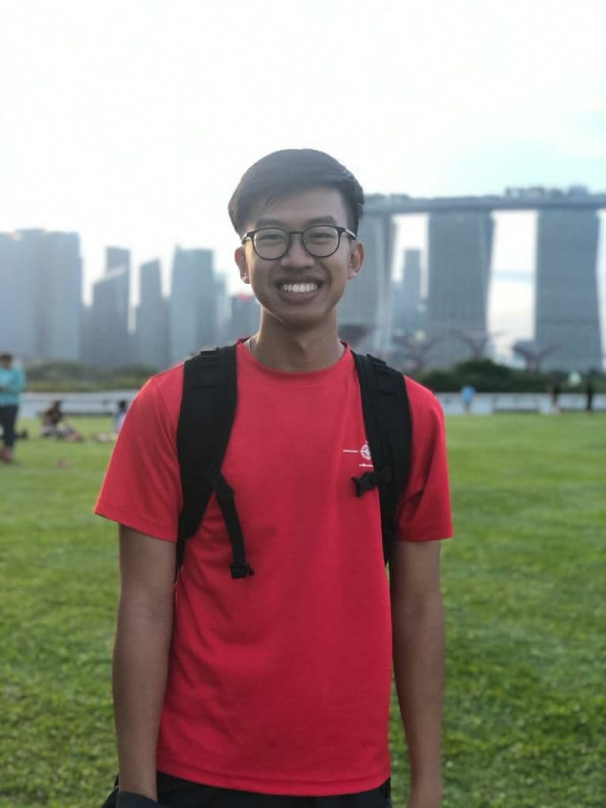
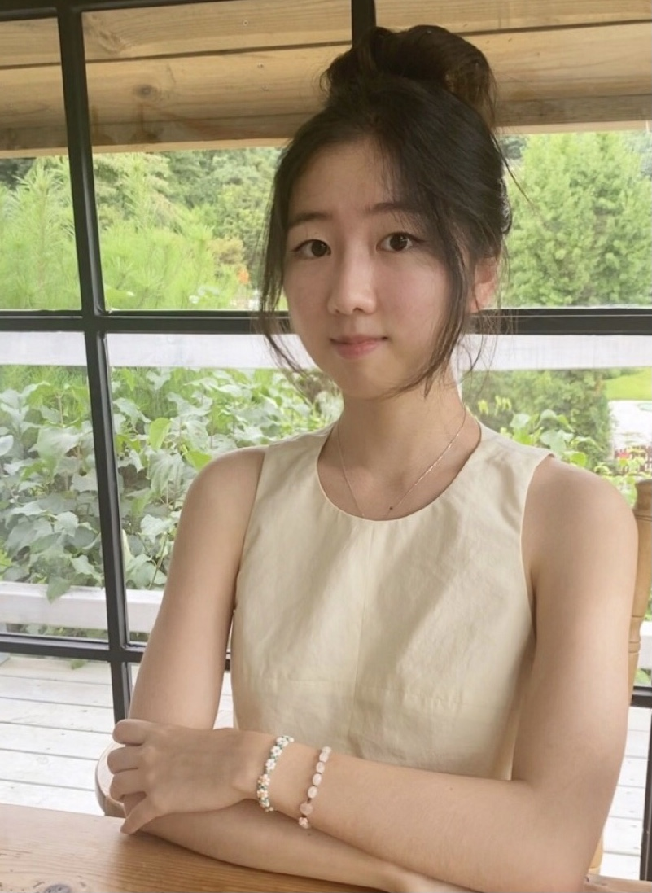
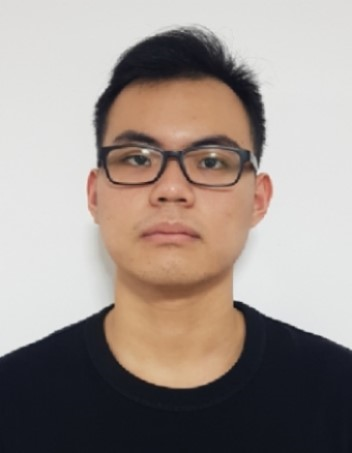
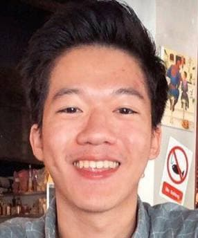

We are a team based in the [School of Computing, National University of Singapore](http://www.comp.nus.edu.sg).

## Project team

### Justin Ng

[[github](https://github.com/Justinnje)]

* Role: Developer - Job Feature
* Responsibilities: Testing

### Rosa Kang

[[github](https://github.com/ro4k9)]

* Role: Developer - Employer Feature
* Responsibilities: Documentation

### Sean Leong

[[github](http://github.com/seanleong339)]

* Role: Developer - Applicant Feature
* Responsibilities: Code Quality

### Chan Yi Juan

[[github](http://github.com/chanyijuan)]

* Role: Developer - List Features
* Responsibilities: Deliverables and deadlines.

### Paing Oo

[[github](http://github.com/e0543517)]
[[portfolio](team/e0543517.md)]

* Role: Scheduler and Tracker
* Responsibilities: UI and Parser
