## Table of Contents
* [Introduction](#introduction)
* [Acknowledgements](#introduction)
* [Setting up, getting started](#setting-up-getting-started)
* [Design](#design-considerations)
  * [Architecture](#architecture)
  * [Ui component](#ui-component)
  * [Logic component](#logic-component)
  * [Model component](#model-component)
  * [Storage component](#storage-component)
  * [Common classes](#common-classes)
* [Implementation](#implementation)
  * [AddApplicant feature](#addapplicant-feature)
  * [EditApplicant feature](#editapplicant-feature)
  * [MarkApplicant feature](#markapplicant-feature)
  * [DeleteApplicant feature](#deleteapplicant-feature)
* [Documentation, logging, testing, configuration, dev-ops](#documentation-logging-testing-configuration-dev-ops)
* [Appendix: Requirement](#appendix-requirements)
  * [Product scope](#product-scope)
  * [User stories](#user-stories)
  * [Use cases](#use-cases)
  * [Non-Fuctional Requirement](#non-functional-requirements)
  * [Glossary](#glossary)
* [Appendix: Instructions for manual testing](#appendix-instructions-for-manual-testing)
  * [Launch and shutdown](#launch-and-shutdown)
  * [Adding an Applicant](#adding-an-applicant)
  * [Editing an Applicant](#editing-an-applicant)
  * [Marking an Applicant](#marking-an-applicant)
  * [Deleting an Applicant](#deleting-an-applicant)
  * [Sorting Applicant](#sorting-applicants)
  * [Adding a Job](#adding-a-job)
  * [Finding a Job](#finding-a-job)
  * [Editing a Job](#editing-a-job)
  * [Marking a Job](#marking-a-job)
  * [Deleting a Job](#deleting-a-job)
  * [Sorting Job List](#sorting-job-list)
  * [Saving data](#saving-data)

--------------------------------------------------------------------------------------------------------------------

## **Introduction**

ReCLIne is a desktop app which serves as a centralised location for recruiters to store and track job applicants and jobs,
optimized for use via a `Command Line Interface (CLI)` while still having the benefits of a `Graphical User Interface (GUI)`.

This Developer Guide assumes that its readers have some basic understanding of programming.

The purpose of this Develop Guide is to aid any curious or interested contributor in developing ReCLIne further by providing
an in-depth explanation of how the features are implemented.

--------------------------------------------------------------------------------------------------------------------

## **Acknowledgements**

* This project is based off the AddressBook-Level3(AB3) project that was created by the [SE-EDU initiative](https://se-education.org/).

--------------------------------------------------------------------------------------------------------------------

## **Setting up, getting started**

Refer to the guide [_Setting up and getting started_](SettingUp.md).

--------------------------------------------------------------------------------------------------------------------

## **Design**

<div markdown="span" class="alert alert-primary">

:bulb: **Tip:** The `.puml` files used to create diagrams in this document can be found in the [diagrams](https://github.com/se-edu/addressbook-level3/tree/master/docs/diagrams/) folder. Refer to the [_PlantUML Tutorial_ at se-edu/guides](https://se-education.org/guides/tutorials/plantUml.html) to learn how to create and edit diagrams.
</div>

### Architecture


The ***Architecture Diagram*** given above explains the high-level design of ReCLIne.

Given below is a quick overview of main components and how they interact with each other.

**Main components of the architecture**

**`Main`** has two classes called [`Main`](https://github.com/AY2122S2-CS2103T-W15-1/tp/blob/master/src/main/java/seedu/address/Main.java) and [`MainApp`](https://github.com/AY2122S2-CS2103T-W15-1/tp/blob/master/src/main/java/seedu/address/MainApp.java).
It is responsible for,
* At app launch: Initializes the components in the correct sequence, and connects them up with each other.
* At shut down: Shuts down the components and invokes cleanup methods where necessary.

[**`Commons`**](#common-classes) represents a collection of classes used by multiple other components.

The rest of the App consists of four components.

* [**`UI`**](#ui-component): The UI of the App.
* [**`Logic`**](#logic-component): The command executor.
* [**`Model`**](#model-component): Holds the data of the App in memory.
* [**`Storage`**](#storage-component): Reads data from, and writes data to, the hard disk.


**How the architecture components interact with each other**

The *Sequence Diagram* below shows how the components interact with each other for the scenario where the user issues the command `deleteapplicant 1`.

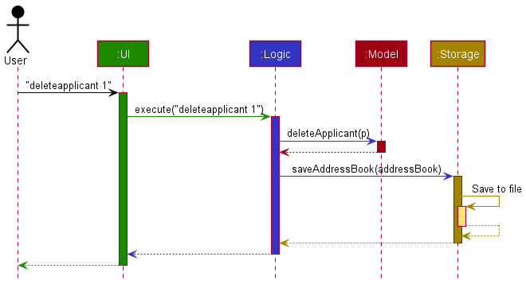

Each of the four main components (also shown in the diagram above),

* defines its *API* in an `interface` with the same name as the Component.
* implements its functionality using a concrete `{Component Name}Manager` class (which follows the corresponding API `interface` mentioned in the previous point.

For example, the `Logic` component defines its API in the `Logic.java` interface and implements its functionality using the `LogicManager.java` class which follows the `Logic` interface. Other components interact with a given component through its interface rather than the concrete class (reason: to prevent outside component's being coupled to the implementation of a component), as illustrated in the (partial) class diagram below.


The sections below give more details of each component.

### UI component

The **API** of this component is specified in [`Ui.java`](https://github.com/AY2122S2-CS2103T-W15-1/tp/blob/master/src/main/java/seedu/address/ui/Ui.java)


The UI consists of a `MainWindow` that is made up of parts e.g.`CommandBox`, `ResultDisplay`, `ApplicantListPanel`,
`JobListPanel`, `StatusBarFooter` etc. All these, including the `MainWindow`, inherit from the abstract `UiPart` class
which captures the commonalities between classes that represent parts of the visible GUI.

The `UI` component uses the JavaFx UI framework. The layout of these UI parts are defined in matching `.fxml`
files that are in the `src/main/resources/view` folder. For example, the layout of the [`MainWindow`]
(https://github.com/AY2122S2-CS2103T-W15-1/tp/blob/master/src/main/java/seedu/address/ui/MainWindow.java) is specified
in [`MainWindow.fxml`](https://github.com/AY2122S2-CS2103T-W15-1/tp/blob/master/src/main/resources/view/MainWindow.fxml)

The `UI` component,

* executes user commands using the `Logic` component.
* listens for changes to `Model` data so that the UI can be updated with the modified data.
* keeps a reference to the `Logic` component, because the `UI` relies on the `Logic` to execute commands.
* depends on some classes in the `Model` component, as it displays `Applicant` or `Job` object residing in the `Model`.

### Logic component

**API** : [`Logic.java`](https://github.com/AY2122S2-CS2103T-W15-1/tp/blob/master/src/main/java/seedu/address/logic/Logic.java)

Here's a (partial) class diagram of the `Logic` component:

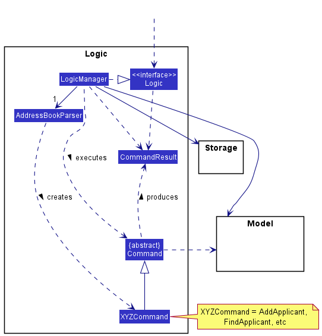

How the `Logic` component works:
1. When `Logic` is called upon to execute a command, it uses the `AddressBookParser` class to parse the user command.
1. This results in a `Command` object (more precisely, an object of one of its subclasses e.g., `AddApplicant`) which is executed by the `LogicManager`.
1. The command can communicate with the `Model` when it is executed (e.g. to add an applicant).
1. The result of the command execution is encapsulated as a `CommandResult` object which is returned from `Logic`.

The Sequence Diagram below illustrates the interactions within the `Logic` component for the `execute("deleteapplicant 1")` API call.


<div markdown="span" class="alert alert-info">:information_source: **Note:** The lifeline for `DeleteApplicantParser` should end at the destroy marker (X) but due to a limitation of PlantUML, the lifeline reaches the end of diagram.
</div>

Here are the other classes in `Logic` (omitted from the class diagram above) that are used for parsing a user command:


How the parsing works:
* When called upon to parse a user command, the `AddressBookParser` class creates an `XYZApplicantParser` or `XYZJobParser` (`XYZ` is a placeholder for the specific command name e.g., `AddApplicantParser` or `AddJobParser`) which uses the other classes shown above to parse the user command and create a `XYZApplicant` object (e.g., `AddApplicant`) which the `AddressBookParser` returns back as a `Command` object.
* All `XYZApplicantParser` and `XYZJobParser` classes (e.g., `AddApplicantParser`, `DeleteApplicantParser`, ...) inherit from the `Parser` interface so that they can be treated similarly where possible e.g, during testing.

### Model component
**API** : [`Model.java`](https://github.com/AY2122S2-CS2103T-W15-1/tp/blob/master/src/main/java/seedu/address/model/Model.java)

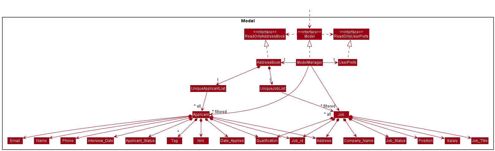 <br>

This is a `slightly zoomed in version` of the Model Diagram for `Applicant`

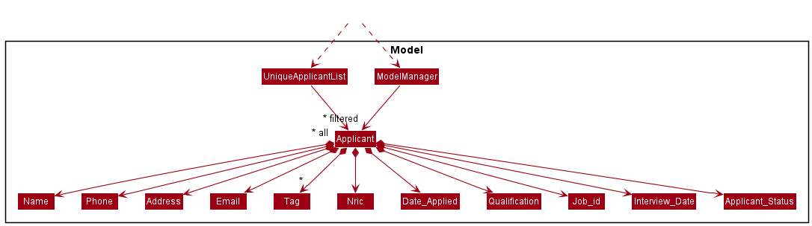

This is a `slightly zoomed in version` of the Model Diagram for `Job`

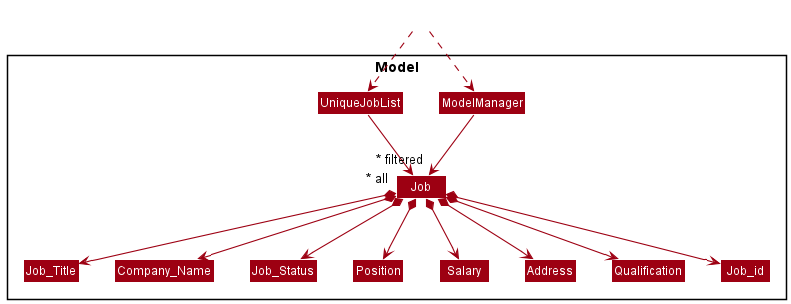

The `Model` component,

* stores the address book data i.e., all `Applicant` objects (which are contained in a `UniqueApplicantList` object) and all `Job` objects (which are contained in a `UniqueJobList` object).
* stores the currently 'selected' `Applicant` or "Job" objects (e.g., results of a search query) as a separate _filtered_ list which is exposed to outsiders as an unmodifiable `ObservableList<Applicant>` or `ObservableList<Job>` that can be 'observed' e.g. the UI can be bound to this list so that the UI automatically updates when the data in the list change.
* stores a `UserPref` object that represents the user’s preferences. This is exposed to the outside as a `ReadOnlyUserPref` objects.
* does not depend on any of the other three components (as the `Model` represents data entities of the domain, they should make sense on their own without depending on other components)

<div markdown="span" class="alert alert-info">:information_source: **Note:** An alternative (arguably, a more OOP) model is given below. It has a `Tag` list in the `AddressBook`, which `Applicant` references. This allows `AddressBook` to only require one `Tag` object per unique tag, instead of each `Applicant` needing their own `Tag` objects.<br>


</div>


### Storage component

**API** : [`Storage.java`](https://github.com/AY2122S2-CS2103T-W15-1/tp/blob/master/src/main/java/seedu/address/storage/Storage.java)


The `Storage` component,
* saves both ReCLIne data and user preference data in json format, and read them back into corresponding objects.
* inherits from both `AddressBookStorage` and `UserPrefStorage`, which means it can be treated as either one (if only the functionality of only one is needed).

The `JsonAdaptedApplicant` and `JsonAdaptedJob` classes are used to convert the Job and Applicant models to and from their JSON format.
`idCount` is an integer that represents the job id to be assigned. When a new Job is added, it will be assigned the current `idCount` as its
job Id. `idCount` will then be incremented, and saved.

<div markdown="span" class="alert alert-info">:information_source: **Note:** Ensure that the `idCount` is not smaller than any of the current Job ids in the Job list. This is because Job Id has to be unique, and since `idCount` is always incremented, it will result in duplicate ids in the application. <br>
</div>

The `JsonSerializableAddressBook` converts the current ReCLIne into a JSON file using the 2 classes, `JsonAdaptedApplicant` and `JsonAdaptedJob`. The idCount integer
in ReCLIne is stored directly without the use of any wrapper class.

The diagram below shows the structure of the JSON file. Applicants are stored in an array in the "applicants" property, while Jobs are stored in an array in "jobs".

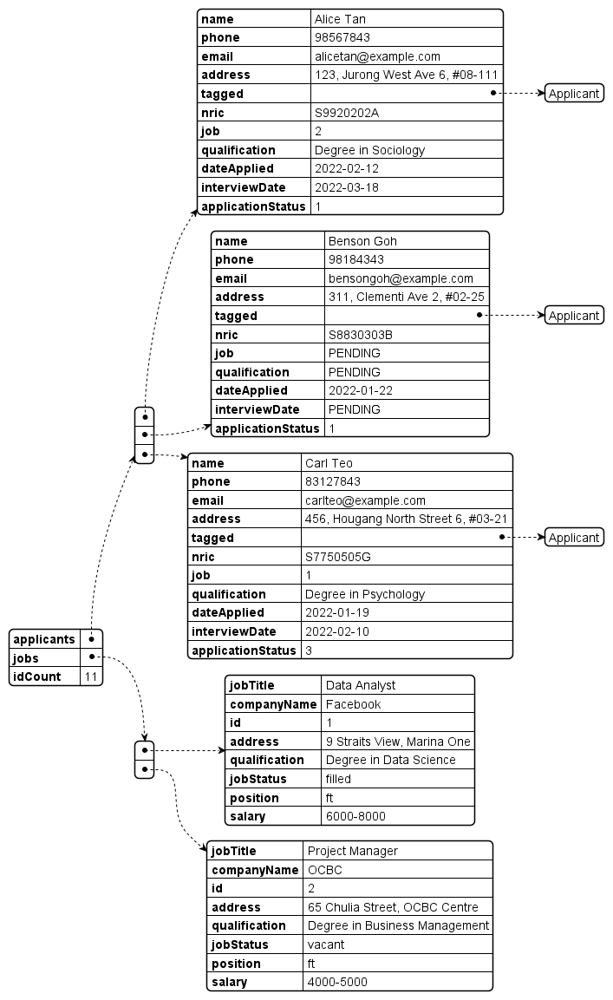

To ensure that the data file is readable by the application, the user must ensure that the data file follows the JSON format shown
below. Take note of the JSON properties, they are **case-sensitive**, and ensure that the JSON object properties match the ones shown **exactly**.

__Sample ReCLIne.json__
```
{
 "applicants" : [ {
    "name" : "Alice Tan",
    "phone" : "98567843",
    "email" : "alicetan@example.com",
    "address" : "123, Jurong West Ave 6, #08-111",
    "tagged" : [ "Applicant" ],
    "nric" : "S9920202A",
    "job" : "2",
    "qualification" : "Degree in Sociology",
    "dateApplied" : "2022-02-12",
    "interviewDate" : "2022-03-18",
    "applicationStatus" : "1"
  }] ,
  "jobs" : [ {
    "jobTitle" : "Data Analyst",
    "companyName" : "Facebook",
    "id" : "1",
    "address" : "9 Straits View, Marina One",
    "qualification" : "Degree in Data Science",
    "jobStatus" : "filled",
    "position" : "ft",
    "salary" : "6000-8000"
  }] ,
  "idCount" : 11
}
```

### Common classes

Classes used by multiple components are in the `seedu.addressbook.commons` package.

Back to [Table of Content](#table-of-content)

--------------------------------------------------------------------------------------------------------------------

## **Implementation**

This section describes some noteworthy details on how certain features are implemented.

### AddApplicant feature
The `addapplicant` mechanism is facilitated by `AddApplicantParser` and `AddApplicant` command. It extends `AddressBook` with the capability to
create new applicants, and store them in the `UniqueApplicantList` of the `AddressBook`. Following the command pattern of the
application, the `parse()` method will parse the user input, use the arguments parsed to create a new `Applicant`, and then
the `Applicant` will be used to create an `AddApplicant` command.
The command will then be executed to add the new `Applicant` to the `AddressBook`.

Given below is an example usage scenario, and how the `addapplicant` mechanism behaves at each step. The scenario assumes that
the application is already launched.

Step 1. The user inputs the command `addapplicant n/John Tan nric/S1374678D p/98765432 e/johntan@hotmail.com a/311, Clementi Ave 2, #02-25 d/21-3-2022`.
The `AddressBookParser#parseCommand()` is called in `LogicManager` and it uses the `BASIC_COMMAND_FORMAT` to separate the `commandWord` and `arguments`.
The `commandWord` will then cause a new `AddApplicantParser` to be created.

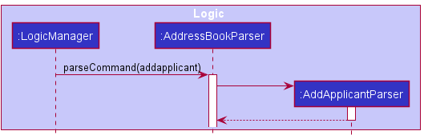

Step 2. The `AddApplicantParser#parse()` method is then called with `arguments` as the argument. The `arguments` will then be
further parsed using their respective class parser methods in `ParserUtil` to create their respective attribute classes,
and then used to create a new `Applicant` object. The `Applicant` object will be used to create a new `AddApplicant` command.

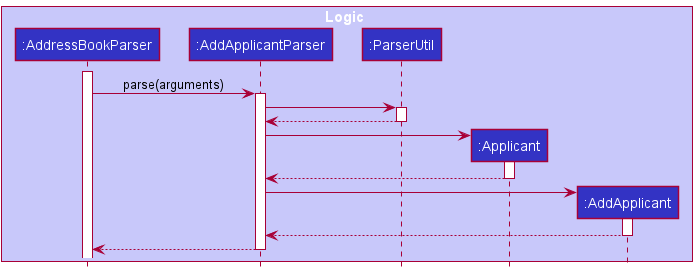

Step 3. The `AddApplicant` command is executed, and it will call the `Model#addApplicant()`, which calls the 
`AddressBook#addApplicant()`, to store the `Applicant` in the `UniqueApplicantList`. 

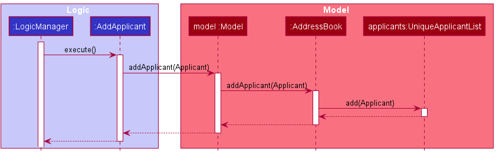

The following sequence diagram shows the full sequence when a user adds a new Applicant
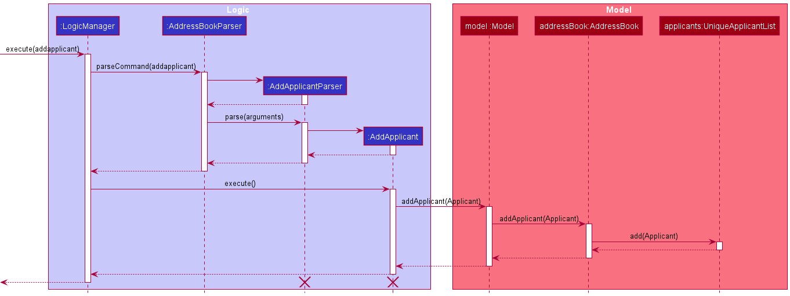

### EditApplicant feature

The `editapplicant` mechanism is facilitated by `AddressBook`. `EditApplicant` extends `Command` class. Within the `EditApplicant` class,
it has a nested class `EditApplicantDescriptor` that is used to store the updated Applicant details that will then be used
to create a new Applicant object. This new Applicant object will replace the current Applicant object that is in the `AddressBook`.

When the user wants to edit an applicant, the user will input `editapplicant` along with the index number of Applicant
and prefix of any attributes that the user wants to change followed by the new value of the attribute. The user only
needs to include the prefixes of attributes that he wants to change for a particular Applicant.

For example, `editapplicant 1 n/Alice Yeoh` will change the name of Applicant 1 to "Alice Yeoh".

Given below is an example usage scenario, and how the `editapplicant` mechanism behaves at each step.

Step 1. The user inputs `editapplicant 1 n/Alice Yeoh` into ReCLIne. `AddressBookParser#parseCommand()` and `EditApplicantParser#parse()`
is executed, which will return a `EditApplicant` object.

<div markdown="span" class="alert alert-info">:information_source: **Note:** If the `index` inputted is greater than the
size of the current `UniqueApplicantList` the execution of the command will fail. A `CommandException` will be thrown
and displayed for the user. This ensures that inputted `index` is not out of bound.

</div>

Step 2. `EditApplcant#execute()` is executed. Firstly, get the current Applicant object that is in the
indicated index in the `UniqueApplicantList`. In this case, Applicant 1 in the `UniqueApplicantList` is stored in the
`applicantToEdit` variable.

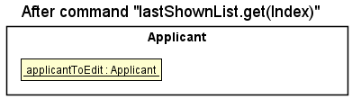

Step 3. Next, a new Applicant object, `editedApplicant`, that is going to replace `applicantToEdit` is created. This is done with
`createEditedApplicant`. Updated information will replace the current Applicant attributes in `applicantToEdit`. All other
attributes will be obtained from the current Applicant object.

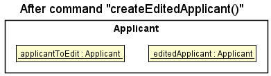

<div markdown="span" class="alert alert-info">:information_source: **Note:** A check between the new Applicant object
and current Applicant object occurs. If both Applicant objects are the same, a `CommandException` is thrown. This ensures
that there is no duplicate Applicants in the `UniqueApplicantList` and `AddressBook`

</div>

Step 4. Lastly, the new Applicant object will replace the current Applicant object of the indicated index number in the
`AddressBook`.

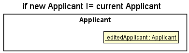

The following sequence diagram shows how the `editapplicant` command works:

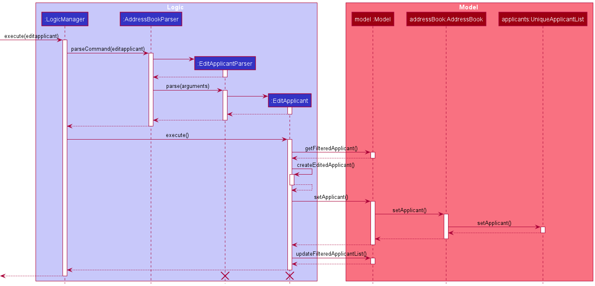

The following activity diagram summarizes what happens when a user executes a new `editapplicant` command:

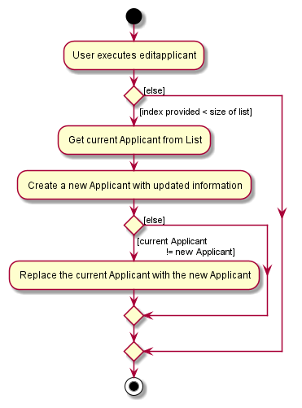


### MarkApplicant feature

The `markapplicant` mechanism is facilitated by `AddressBook`. `MarkApplicant` extends `Command` class.
`MarkApplicant` updates the status via creating a new applicant object with  the new status value
and same original Applicant details.  This new Applicant object will replace the current Applicant object that is in the `AddressBook`.

When the user wants to mark an applicant, the user will input `markapplicant` along with the index number of Applicant,
and the new status value, which includes `pending`, `rejected`, `interviewed`,and `accepted`.

For example, the applicant has the default state of `pending` when it is initialized.
A command `markapplicant 1 s/rejected` will change the status of applicant in index 1 to rejected.

Given below is an example usage scenario, and how the `markapplicant` mechanism behaves at each step.

Step 1. The user inputs `markapplicant 1 s/rejected` into ReCLIne. `AddressBookParser#parseCommand()`
and `MarkApplicantParser#parse()`. `MarkApplicantParser#parse()`calls `ParserUtil#parseIndex()` and `ParserUtil#parseApplicant()`,
which returns Index and ApplicantStatus objects representing the index and status value that user inputted. This returns a
`MarkApplicant` with Index and ApplicantStatus objects as arguments.


<div markdown="span" class="alert alert-info">:information_source: **Note:** If the `index` inputted is greater than the
size of the current `UniqueApplicantList` the execution of the command will fail. A `CommandException` will be thrown
and displayed for the user. This ensures that inputted `index` is not out of bound.
</div>


Step 2. `MarkApplicant#execute()` is executed. Firstly, get the current Applicant object that is in the
indicated index in the `UniqueApplicantList`. In this case, Applicant 1 in the `UniqueApplicantList` is stored in the
`applicantToMark` variable.

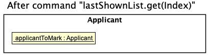

Step 3. Next, a new Applicant object, `markedApplicant`, that is going to replace `applicantToMark` is created.
This is done by creating a new instance of `Applicant` with ApplicantStauts object containing the status
inputted by the user, in this case `rejected`.

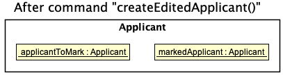

<div markdown="span" class="alert alert-info">:information_source: **Note:** A check between the new Applicant object
and current Applicant object occurs. If both Applicant objects are the same, a `CommandException` is thrown. This ensures
that there is no duplicate Applicants in the `UniqueApplicantList` and `AddressBook`
</div>

Step 4. Lastly, `markedApplicant`t will replace the current A`applicantToMark` of the indicated index number in the
`AddressBook`.

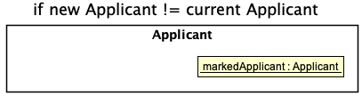

The following sequence diagram shows how the `markapplicant` command works:

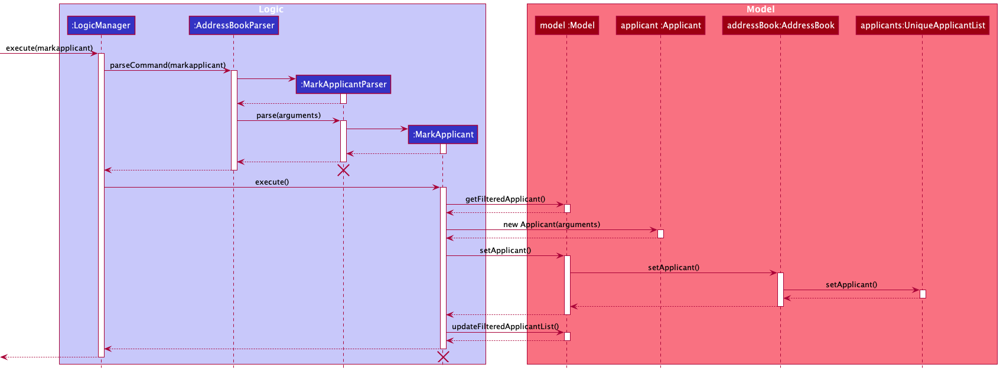

The following activity diagram summarizes what happens when a user executes a new `markapplicant` command:

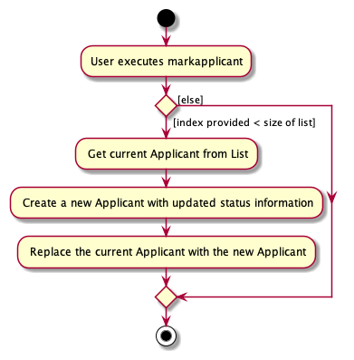

### DeleteApplicant feature

The `deleteapplicant` mechanism is facilitated by `AddressBook`. `DeleteApplicant` extends `Command` class.

When the user wants to delete an applicant from the address book, the user will input `deleteapplicant` along with the
index number of the applicant. Note that this index is the same as the index that is displayed to the user under the
applicant list tab in the ReCLIne application.

Given below is an example usage scenario and how the `deleteapplicant` mechanism behaves at each step.

Step 1. The user inputs `deleteapplicant 1` into ReCLIne. `LogicManager#execute()` is executed, inside this method,
`LogicManager#execute()` is executed which will return a DeleteApplicant object.

Step 2. Inside `LogicManager#execute()`, `DeleteApplicant#execute()` is executed. Inside this method, we obtained the last
shown applicant list by calling `Model#getFilteredApplicantList()`. We also check if the index is invalid in `DeleteApplicant#execute()`.

<div markdown="span" class="alert alert-info">:information_source: **Note:** If the `index` inputted is invalid, meaning
that it is greater than the size of the current `UnqiueApplicantList` or it is a negative integer or 0, the execution of
the command will fail and `AddressBookParser#parseCommand()` will throw a `CommandException` and the
`MESSAGE_INVALID_APPLICANT_DISPLAYED_INDEX` will be displayed to the user. This ensures that the inputted `index` is not out of bound.

</div>

Step 3. Next, we obtain the zero base of the target index by calling `Index#getZeroBased()`. This is because the index displayed in the applicant
list tab in the application list is in one based eg 1,2,3,4... We obtained the zero based of the target index so that we are able to get the
true index of the applicant in the last shown applicant list. We then obtain the applicant to delete from the last shown list via the zero based index

Step 4. Lastly, We then call `Model#deleteApplicant()` which will delete the targeted applicant from the applicant list.
The applicant will display the new applicant list without the deleted applicant and a MESSAGE_DELETE_APPLICANT_SUCCESS is shown.

The following sequence diagram shows how the `deleteapplicant` command works:

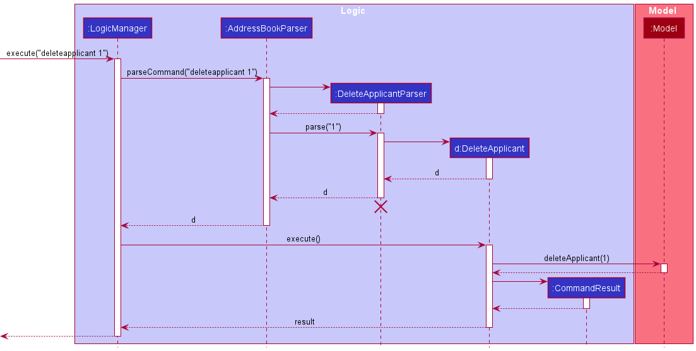

### AddJob feature
The design implementation for AddJob is similar to that for AddApplicant, but with classes to add a Job instead of Applicant. Refer to the section [above](DeveloperGuide.md#addapplicant-feature) on AddApplicant for the design considerations.

#### Design considerations:

### EditJob feature
The design implementation for EditJob is similar to that for EditApplicant, but with classes to add a Job instead of Applicant. Refer to the section [above](DeveloperGuide.md#editapplicant-feature) on EditApplicant for the design considerations.

### MarkJob feature
The design implementation for MarkJob is similar to that for MarkApplicant, but with classes to add a Job instead of Applicant. Refer to the section [above](DeveloperGuide.md#markapplicant-feature) on MarkApplicant for the design considerations.

### DeleteJob feature
The design implementation for DeleteJob is similar to that for DeleteApplicant, but with classes to add a Job instead of Applicant. Refer to the section [above](DeveloperGuide.md#deleteapplicant-feature) on DeleteApplicant for the design considerations.

Back to [Table of Content](#table-of-content)

--------------------------------------------------------------------------------------------------------------------

## **Documentation, logging, testing, configuration, dev-ops**

* [Documentation guide](Documentation.md)
* [Testing guide](Testing.md)
* [Logging guide](Logging.md)
* [Configuration guide](Configuration.md)
* [DevOps guide](DevOps.md)

--------------------------------------------------------------------------------------------------------------------

## **Appendix: Requirements**

### Product scope

**Target user profile**:
* Job recruiters who have to sieve through numerous CVs a day and contact multiple people for different job applications
* Prefer desktop apps over other types
* Can type fast
* Prefers typing to mouse interactions
* Is reasonably comfortable using CLI apps

**Value proposition**: Our application helps to organize the contacts by priority, keeps contacts in a centralized workspace, streamlines workflow and increases efficiency of recruiter work


### User stories

Priorities: High (must have) - `* * *`, Medium (nice to have) - `* *`, Low (unlikely to have) - `*`

| Priority | As a …​                                    | I want to …​                     | So that I can…​                                                        |
| -------- | ----------------------------------------| ------------------------------ | ---------------------------------------------------------------------- |
| `* * *`  | new recruiter                           | see usage instructions         | refer to instructions when I forget how to use the App                 |
|  `* * *` | recruiter                               | add an Applicant that is applying for a Job | save the Applicant’s details into the database            |
|  `* * *` | recruiter                               | add the name of Applicant that applied | know the name of the Applicant |
|  `* * *` | recruiter                               | add the phone number of Applicant that applied | know how to contact the Applicant |
|  `* * *` | recruiter                               | add the email of Applicant that applied | know an alternative method to contact the Applicant |
|  `* * *` | recruiter                               | add the home address of Applicant that applied | match Jobs that are closer to the Applicant’s home|
|  `* * *` | recruiter                               | add the date the Applicant that applied | know and sort the Applicant list by the date applied |
|  `* * *` | recruiter                               | add the NRIC of Applicant that applied | know the NRIC of the Applicant |
|  `* * *` | recruiter                               | add tags that are associated with the  Applicant | add additional information associated with the Applicant |
|  `* * *` | recruiter                               | edit an Applicant’s details  | keep the contact details updated during the recruitment process |
|  `* * *` | recruiter                               | edit the name of Applicant that applied | update the name of the Applicant |
|  `* * *` | recruiter                               | edit the phone number of Applicant that applied | update how to contact the Applicant |
|  `* * *` | recruiter                               | edit the email of Applicant that applied | update an alternative method to contact the Applicant |
|  `* * *` | recruiter                               | edit the home address of Applicant that applied | update the address of an Applicant |
|  `* * *` | recruiter                               | edit the date the Applicant that applied | update and keep track of the date applied|
|  `* * *` | recruiter                               | edit the NRIC of Applicant that applied | update the NRIC of the Applicant in case of any error |
|  `* * *` | recruiter                               | edit tags that are associated with the  Applicant | update additional information associated with the Applicant |
|  `* * *` | recruiter                               | edit the Job ID of the Job that the Applicant that applied | keep track and sort the list of Applicants by Job ID |
|  `* * *` | recruiter                               | edit the Qualification the Applicant has | match the Applicant’s qualification to the Job qualification requirement |
|  `* * *` | recruiter                               | edit the Interview Date of the Applicant | know when to contact the Applicant again for an interview reminder |
|  `* * *` | recruiter                               | delete an Applicant contact| keep the database neat |
|  `* * *` | recruiter                               | mark status of the Applicant’s interview status | keep track of the status of all Applicants |
|  `* * *` | recruiter                               | mark whether an Applicant has been interviewed |  make sure not to contact him twice |
|  `* * *` | recruiter                               | mark a contact as pending for a Job posting| keep track of Applicants who are pending|
|  `* * *` | recruiter                               | create a new Job posting | add the Job into the database and find suitable Applicants for a Job opening |
|  `* * *` | recruiter                               | add the Job Title of a new Job posting | know the name of the job |
|  `* * *` | recruiter                               | add the company name that is providing the new Job posting | know which company the Job Posting is for |
|  `* * *` | recruiter                               | add the ID of the Job posting | assign the Applicant to a Job |
|  `* * *` | recruiter                               | add the address of where the Job is at | match Applicant to Jobs that are near their home address |
|  `* * *` | recruiter                               | add the Salary of a new Job posting | provide the Salary information to Applicants |
|  `* * *` | recruiter                               | add the position (Part time, Contract, Permanent) of a new Job posting | provide the position information to Applicants |
|  `* * *` | recruiter                               | add the Qualifications required for the Job posting | match the Applicant’s qualification to the Job qualification requirement |
|  `* * *` | recruiter                               | edit a current Job posting | update the Job in the database and find suitable Applicants for a Job opening |
|  `* * *` | recruiter                               | edit the Job Title of a new Job posting | update the name of the job |
|  `* * *` | recruiter                               | edit the company name that is providing the new Job posting | edit which company the Job Posting is for |
|  `* * *` | recruiter                               | edit the ID of the Job posting | edit which job is assigned to the Applicant |
|  `* * *` | recruiter                               | edit the address of where the Job is at | better match Applicant to Jobs that are near their home address |
|  `* * *` | recruiter                               | edit the Salary of a new Job posting | provide updated Salary information to Applicants |
|  `* * *` | recruiter                               | edit the position (Part time, Contract, Permanent) of a new Job posting | provide the updated position information to Applicants |
|  `* * *` | recruiter                               | edit the qualifications required for the Job posting | better match the Applicant’s qualification to the Job qualification requirement |
|  `* * *` | recruiter                               | delete a Job posting contact| keep the database neat |
|  `* * *` | recruiter                               | mark whether the Job is filled or not | know which Job posting is currently still hiring |
|  `* * *` | recruiter                               | list out all Applicants in my database| view all Applicants in the database |
|  `* * *` | recruiter                               | list out all Job postings in my database| view all Job postings and also |
|  `* * *` | recruiter                               |  Sort all Applicants in my database by the date applied | prioritise which Applicants to Job match for |
|  `* * *` | recruiter                               |  Sort all Applicants in my database by the interview date | check whose interviews are coming up and send them a reminder |
|  `* * *` | recruiter                               |  Sort all Applicants in my database by the Job ID | check which Job I have applied for which Applicant |
|  `* * *` | recruiter                               |  Sort all Jobs in my database by whether the Job is filled or not | prioritise on Jobs that are not filled yet |
|  `* * *` | recruiter                               |  Search the Applicant database for a particular Applicant | quickly search for the Applicant when needed |
|  `* * *` | recruiter                               |  Search the Jobs database for a particular Job | quickly search for the Job when needed |
|  `* *` | recruiter                               | record down that replies from the interviewee during the interview| have a centralized location for all interviewees’ answers |
|  `* *` | recruiter                               | save the questions that need to be asked during the interview| ask important questions during the interview|
|  `*` | recruiter                               | add the Employer's contact details | keep track of the employer’s contact details. |
|  `*` | recruiter                               | add the qualification requirement that an Employer is looking for | know what type of Applicants the Employer is looking for|
|  `*` | recruiter                               | edit Employer’s details| keep the details up to date|


### Use cases


**Use case: Mark an Applicant as interviewed**

Precondition: Recruiter knows the applicant contact ID

**MSS**

1. Recruiter requests to mark a specific Applicant as interviewed given their ID and /i flag.
2. ReCLIne marks the person as interviewed.

    Use case ends.

**Extensions**

* 1a. ID is not given

    * 1a1. ReCLIne shows an error message.
    * 1a2. Recruiter enters the command with a valid ID

       Use case resumes from step 2.

* 1b. The given ID is invalid.

    * 1b1. ReCLIne shows an error message.
    * 1b2. Recruiter enters the command with another ID

      Steps 1b1 and 1b2 repeats until Recruiter enters a valid Id. Use case resumes from step 2.

*{More to be added}*


**Use case: Delete an Applicant Contact**

Precondition: Recruiter knows the applicant contact ID

Guarantees:
-  ReCLine will only delete a contact if the contact exists.

**MSS**

1.  Recruiter indicates that he wants to delete a contact.
6.  ReCLine deletes indicated contact from database and shows a success message.

    Use case ends

**Extensions**

* 2a.  Indicated contact is not found on the database.
    * 2a1. ReCLine shows an error message.
    * 2a2. Recruiter enters new data.

Steps 2a1 – 2a2 are repeated until the contact inputted exists in the database.
Use case resumes at step 3.

* 3a. The given index is invalid.

    * 3a1. ReCLIne shows an error message.

      Use case resumes at step 2.

*{More to be added}*

**Use case: Mark an Applicant job application status as pending.**

**MSS**

1. Recruiter enters command to mark an applicant job application status as pending.
2. ReCLIne gives confirmation and mark status as pending.
3. ReCLIne displays the updated applicant list.

   Use case ends.

**Extensions**

* 1a. Recruiter enters wrong command.
    * 1a1. ReCLIne responds saying that command is
      invalid.
    * 1a2. Recruiter enters new command.


Steps 1a1-1a2 are repeated until recruiter enters
correct command.

Use case resumes from step 2.


* 1b. Recruiter enters wrong format for mark command.
    * 1b1. ReCLIne responds with the correct format for
      mark command.
    * 1b2. Recruiter enters new command.

Steps 1b1-1b2 are repeated until recruiter enters
correct format.
Use case resumes from step 2.

* 1c. Recruiter inputs an applicant that is not found in the
  address book.
    * 1c1. ReCLIne responds with invalid applicant.
    * 1c2. Recruiter enters new command.
      Steps 1c1-1c2 are repeated until recruiter enters
      valid applicant.

      Use case resumes from step 2.


*{More to be added}*

**Use case: Edit the date of an Applicant upcoming job interview**

Precondition: Recruiter knows the applicant contact ID

**MSS**

1. Recruiter enters command to edit date of interview of an Applicant.
2. ReCLIne gives confirmation and displays new Applicant attributes.

   Use case ends.

**Extensions**

* 1a. Recruiter inputs an invalid Id

    * 1a1. ReCLIne shows an error message saying that Id is invalid.
    * 1a2. Recruiter enters new edit command with correct Id.

      Steps 1a1-1a2 are repeated until recruiter enters
      valid Id. Use case resumes from step 2.

* 1b. Recruiter enters the wrong flag.

    * 1b1. ReCLIne shows an error message saying that argument is invalid.
    * 1b2. Recruiter enters new edit command with correct flag.

      Steps 1b1-1b2 are repeated until recruiter enters
      correct flag. Use case resumes from step 2.

*{More to be added}*

Use case: List out all job postings in my database

Precondition: Recruiter has previously added job postings

MSS

1. Recruiter enters command to list all job postings.
2. ReCLIne gives confirmation and displays all job posting.

   Use case ends.

Extensions

* 1a. There are no job postings in the database

    * 1a1. ReCLIne shows message that stating that there are no job postings yet
    * 1a2. Recruiter adds job posting (if applicable, otherwise stop attempting to list)

      Steps 1a1-1a2 are repeated until recruiter adds a job posting. Use case resumes from step 2.

* 1b. Recruiter enters unnecessary/invalid argument

    * 1b1. ReCLIne shows an error message saying that argument is invalid.
    * 1b2. Recruiter enters new list command without argument.

      Steps 1b1-1b2 are repeated until recruiter removes invalid argument. Use case resumes from step 2.

*{More to be added}*


### Non-Functional Requirements

1. Should work on any _mainstream OS_ as long as it has Java `11` or above installed.
2. Should be able to hold up to 1000 contacts without a noticeable sluggishness in performance for typical usage.
3. A user with above average typing speed for regular English text (i.e. not code, not system admin commands) should be
able to accomplish most of the tasks faster using commands than using the mouse.
4. Documentaion follows Java SE convention.
5. The system should respond within two seconds.


*{More to be added}*

### Glossary

* **Mainstream OS**: Windows, Linux, Unix, OS-X
* **Private contact detail**: A contact detail that is not meant to be shared with others

--------------------------------------------------------------------------------------------------------------------

## **Appendix: Instructions for manual testing**

Given below are instructions to test the app manually.

<div markdown="span" class="alert alert-info">:information_source: **Note:** These instructions only provide a starting point for testers to work on;
testers are expected to do more *exploratory* testing.

</div>

### Launch and shutdown

1. Initial launch

   1. Download the jar file and copy into an empty folder

   1. Double-click the jar file Expected: Shows the GUI with a set of sample contacts. The window size may not be optimum.

1. Saving window preferences

   1. Resize the window to an optimum size. Move the window to a different location. Close the window.

   1. Re-launch the app by double-clicking the jar file.<br>
       Expected: The most recent window size and location is retained.

1. _{ more test cases …​ }_

### Adding an Applicant
1. Adding an Applicant to the application

    1. Test case: `addapplicant n/Rick Sanchez nric/S2344567D p/98765432 e/rick@mort.com a/311, Jurong Ave 2, #08-19 d/2022-03-21 t/lab-trained`
        Expected: An applicant named Rick Sanchez, with all the information in the command above, will be added. However, his interview date,
       job Id, Qualification and application status will all be "PENDING" as they have not been confirmed.
       
    2. Test case: `addapplicant n/Rick Sanchez p/98765432 e/rick@mort.com a/311, Jurong Ave 2, #08-19 d/2022-03-21`
    Expected: No applicant will be added. An error message with the correct command usage will be shown.
       
    3. Test case: `addapplicant n/Rick Sanchez j/2 nric/S2344567D p/98765432 e/rick@mort.com a/311, Jurong Ave 2, #08-19 d/2022-03-21 t/lab-trained`
    Expected: No applicant will be added as command includes a field (j/) that should be added by editapplicant. An error message detailing the error and how
       to use the command will be shown.
       Other incorrect fields to try are `q/` and `i/`.

### Editing an Applicant
1. Adding an Applicant to the application

    1. Test case: `editapplicant 2 n/Benjamin Oscar e/benjaminoscar123@example.com a/Block 233 Broadway Street 2, #09-111, i/2022-04-23`
        
        Expected: An applicant at index 2 on the displayed list of applicants, will have his name, email, address and interview date changed.
        
        Note: If the interview date inputted is earlier than the date applied, an error will be shown and the applicant at index 2 will 
        not be edited.
       
        Note: If there are less than 2 applicants in the list, an error message detailing the error will be shown.
       
    2. Test case: `editapplicant 19 n/Stephen Curry p/92881727 e/stephencurry30@example.com p/90221122`
       
        Expected: An applicant at index 19 in the displayed list of applicants, will have his name, phone number and email changed.
    
        Note: The application will take the last instance of the field if there are duplicate fields inputted in a single command.
    
    3. Test case: `editapplicant n/Andrew Goodwill p/91238321 e/andrewgoodwill@example.com d/2022-03-22 i/2022-04-10`
        
        Expected: No applicant will be edited, since no applicant index was specified in the command. 
       
    4. Test case: `editapplicant 11 n/Michael Jordan p/94448321 e/michaeljordan@example.com sal/3000-4000`
        
        Expected: No applicant will be edited, since there is an invalid flag that was specified in the command. An error message
        detailing the error and how to use the command will be shown.
       
        Note: If there are less than 11 applicants in the list, an error message detailing the error will be shown.
    
### Marking an Applicant
1. Updating an Applicant's application status on the application

    1. Test case: `markapplicant 95 s/interviewed`
       Expected: An applicant at index 95 on the displayed list of applicants will have their application status updated to `interviewed`.
       If there are less than 95 applicants in the list, an error message detailing the error and how to use the command will be shown. 

    2. Test case: `markapplicant s/accepted`
       Expected: No applicant status will be updated, since no applicant index was specified with the (s/) command field prefix. 
       An error message detailing the error and how to use the command will be shown.

    3. Test case: `markapplicant 13 q/rejected`
       Expected: No applicant status will be updated, as no command field prefix (q/) is accepted for `markapplicant`. 
       An error message detailing the error and how to use the command will be shown.
       `markapplicant` only accepts `s/` as a command field prefix.

   4. Test case: `markapplicant 42 s/deciding`
      Expected: No applicant status will be updated, as `deciding` is not a valid application status.
      An error message detailing the error and how to use the command will be shown.
      The only valid statuses are `pending`, `interviewed`, `accepted` and `rejected`.

### Deleting an Applicant

1. Deleting an applicant while all applicants are being shown

    1. Prerequisites: List all applicants by clicking on the Applicant tab on the GUI or by using the `tabapplicant` command. Multiple applicants in the list.

    1. Test case: `deleteapplicant 1`<br>
       Expected: First applicant is deleted from the list. Details of the deleted applicant shown in the status message. Timestamp in the status bar is updated.

    1. Test case: `deleteapplicant 0`<br>
       Expected: No applicant is deleted. Error details shown in the status message. Status bar remains the same.

    1. Other incorrect deleteapplicant commands to try: `deleteapplicant`, `deleteapplicant x`, `...` (where x is larger than the list size)<br>
       Expected: Similar to previous.

### Sorting Applicants
1. Sort the applicant list by a given attribute

    1. Test case: `sortapplicant by/dateapplied`
       Expected: The applicant list will be sorted by the date they applied, from earliest to most recent date applied.
       If the applicant list is empty, an error message detailing the error will be shown.

    2. Test case: `sortapplicant`
       Expected: The applicant list will not be sorted, as no sorting attribute was specified.

    3. Test case: `sortapplicant by/tags`
       Expected: The applicant list will not be sorted, as `tags` are not a valid sorting attribute. 
       The only valid attributes are `dateapplied`, `interview`, and `job`. 
       An error message detailing the error and how to use the command will be shown.
       
### Adding a Job
1. Adding a Job to the application
    1. Test case: `addjob jt/Devops Engineer c/Ebiz Pte Ltd a/59 Hougang Road Blk 38 q/Bachelors in Computer Science pos/ft sal/3000-4000 `
        Expected: A Job listing for Devops Engineer, including all the included information in the command above, will be added to the Job list.
        The job status will always be vacant by default.

    2. Test case: `addjob jt/Devops Engineer a/59 Hougang Road Blk 38 q/Bachelors in Computer Science pos/ft sal/3000-4000`
        Expected: No Jobs will be added. The error message for wrong command format will be shown in the status window.

### Finding a Job
1. Find a Job in job list give job title or job id

    1. Test case: `findjob jt/Software Engineer`
       Expected: Jobs with job title containing the keyword `Software` or `Engineer` is listed on the job list panel. The number of
   jobs matching the condition is displayed in the status message.

    2. Test case: `findjob id/3`
       Expected: A job with job id `3` is listed  on the job list panel.

    3. Test case: `findjob jt/Engineer id/3`
       Expected: No jobs are. Error details shown in the status message. The job list panel remains the same.

    4. Other incorrect delete commands to try: `findjob`, `findjob id/x`, `findjob jt/`, `findjob id/`, `...`(where x is a non-positive integer including 0)<br>
          Expected: Similar to previous.       
### Editing a Job
1. Adding a Job to the application

    1. Test case: `editjob 2 jt/Project Facilitator c/Microsoft sal/2000-6000`

       Expected: A job at index 2 on the displayed list of jobs, will have its Job Title, Company name and Salary changed.

       Note: If there are less than 2 applicants in the list, an error message detailing the error will be shown.

    2. Test case: `editjob jt/Software Designer UI sal/10000-20000 pos/ft`

       Expected: No job will be edited, since no job index was specified in the command. An error message
       detailing the error and how to use the command will be shown.

    3. Test case: `editjob 11 c/HP sal/10000-11000 sth/Something`

       Expected: No applicant will be edited, since there is an invalid flag that was specified in the command. 

       Note: If there are less than 11 jobs in the list, an error message detailing the error will be shown.
       
### Marking a Job
1. Updating a Job listing's fulfillment status on the application

    1. Test case: `markjob 54 js/filled`
       Expected: An job listing at index 54 on the displayed job list will be marked as `filled`.
       If there are less than 54 job listings, an error message detailing the error and how to use the command will be shown.

    2. Test case: `markjob js/accepted`
       Expected: No job listing status will be updated, since no job listing index was specified with the (js/) command field prefix.
       An error message detailing the error and how to use the command will be shown.

    3. Test case: `markjob 13 q/rejected`
       Expected: No job listing will be added as no command field prefix (q/) is accepted for `markjob`.
       An error message detailing the error and how to use the command will be shown.
       `markjob` only accepts `js/` as a command field prefix.

    4. Test case: `markjob 42 js/deciding`
       Expected: No job listing status will be updated, as `deciding` is not a valid job fulfillment status.
       An error message detailing the error and how to use the command will be shown.
       The only valid statuses are `filled`, and `vacant`.
       
### Deleting a Job

1. Deleting a Job while all jobs are being shown

    1. Prerequisites: List all jobs by clicking on the Job tab on the GUI or by using the `tabjob` command. Multiple jobs in the list.

    2. Test case: `deletejob 1`<br>
       Expected: First job is deleted from the list. Details of the deleted job shown in the status message. Timestamp in the status bar is updated.

    3. Test case: `deletejob 0`<br>
       Expected: No job is deleted. Error details shown in the status message. Status bar remains the same.

    4. Other incorrect deletejob commands to try: `deletejob`, `deletejob x`, `...` (where x is larger than the list size)<br>
       Expected: Similar to previous.

### Sorting Job List

1. Sorting the Job List by job status.

    1. Prerequisites: List all jobs by clicking on the Job tab on the GUI or by using the `tabjob` command. Multiple jobs in the list with different job status.

    1. Test case: `sortjob`<br>
       Expected: Jobs are sorted by the job status with 'vacant' before 'filled'. SortJob success message shown in the status bar.

### Saving data

1. Dealing with missing/corrupted data files
   1. Missing data file
      1. When ReCLIne cannot find a data file, it will automatically generate a sample data file containing sample data.
    This happens by default when a user installs a new ReCLIne for the first time. A user can look out for this log
         message when he starts the application to confirm. 
`"INFO: Data file not found. Will be starting with a sample ReCLIne"`
         
   2. Corrupted data file
      1. If the data file has been corrupted, or is unable to be read by ReCLIne for any reason, the application will
    start with an empty list for both applicants and jobs. A user can look out for this log message when he starts
         the application to confirm. `"WARNING: Data file not in the correct format. Will be starting with an empty ReCLIne"`
         
   3. Solutions
      1. To restart the application with a sampledata book, users will need to delete the data folder generated in the same folder
    as their ReCLIne.jar file.
      2. If the user is familiar with the JSON format, and wants to fix the corrupted file, he can attempt to do so by opening
    the `ReCLIne.json` file in the data folder, and try fixing the format error. Refer to the [storage section](DeveloperGuide.md#storage-component) of this Developer Guide
         to see the storage file format.
