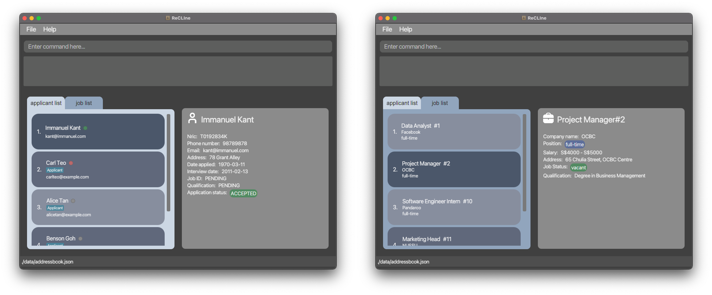

ReCLIne is a **desktop app which serves as a centralised location for recruiters to store and track job applicants and jobs, optimized for use via a
Command Line Interface** (CLI) while still having the benefits of a Graphical User Interface (GUI).
If you can type fast, ReCLIne can get your contact management tasks done faster than traditional GUI apps.

* Table of Contents
    * [Quick Start](#quick-start)
    * [Features](#features)
    * [FAQ](#faq)
    * [Command Summary](#command-summary)

--------------------------------------------------------------------------------------------------------------------

## Quick Start

1. Ensure you have Java `11` or above installed in your Computer.

1. Download the latest `ReCLIne.jar` from [here](https://github.com/AY2122S2-CS2103T-W15-1/tp/releases).

1. Copy the file to the folder you want to use as the _home folder_ for your ReCLIne.

1. Double-click the file to start the app. The GUI similar to the below should appear in a few seconds. Note how the app contains some sample data. 
   

1. Type the command in the command box and press Enter to execute it. e.g. typing **`help`** and pressing Enter will open the help window. 
   Some example commands you can try:

   * **`addapplicant`**`n/Jaden Ho p/92812192 nric/S1234567A a/Tampines St 96 Block 312 e/jadenho@email.com d/2022-03-12` : Adds a contact named `Jaden Ho` to the Address Book.

   * **`deleteapplicant`**`3` : Deletes the 3rd contact shown in the current list.

   * **`editapplicant`**`1  e/jadenho@email.com q/Degree in Computer Science i/2022-03-18` : Edits Applicant 3 changing the email, qualification and interview date.

   * **`exit`** : Exits the app.

1. Refer to the [Features](#features) below for details of each command.

--------------------------------------------------------------------------------------------------------------------

## Features

**:information_source: Notes about the command format:** 

* Words in `UPPER_CASE` are the parameters to be supplied by the user. 
  e.g. in `add n/NAME`, `NAME` is a parameter which can be used as `add n/John Doe`.

* Items in square brackets are optional. 
  e.g `n/NAME [t/TAG]` can be used as `n/John Doe t/friend` or as `n/John Doe`.

* Items with `…`​ after them can be used multiple times including zero times. 
  e.g. `[t/TAG]…​` can be used as ` ` (i.e. 0 times), `t/friend`, `t/friend t/family` etc.

* Parameters can be in any order. 
  e.g. if the command specifies `n/NAME p/PHONE_NUMBER`, `p/PHONE_NUMBER n/NAME` is also acceptable.

* If a parameter is expected only once in the command but you specified it multiple times, only the last occurrence of
  the parameter will be taken. 
  e.g. if you specify `p/12341234 p/56785678`, only `p/56785678` will be taken.

* Extraneous parameters for commands that do not take in parameters (such as `help`, `list`, `exit` and `clear`)
  will be ignored. 
  e.g. if the command specifies `help 123`, it will be interpreted as `help`.

### Viewing help : `help` [coming soon]

Shows a message explaning how to access the help page.

Format: `help`

### Adding an Applicant to the ApplicantList: `addapplicant`

Adds an applicant to the applicant list of ReCLIne.

Format: `addapplicant *n/[NAME] *p/[PHONE] *nric/[NRIC] *a/[ADDRESS] *e/[EMAIL]
            *d/[DATEAPPLIED]`

Tip: Fill in fields in any order. All fields are compulsory.

*flag/[ATTRIBUTE]:*

`n/[NAME]`: Applicant's name

`p/[PHONE]`: Applicant's phone number

`nric/[NRIC]`: Applicant's NRIC

`a/[ADDRESS]` : Applicant's address

`e/[EMAIL]` : Applicant's email address

`d/[DATEAPPLIED]` : Date that Applicant applied for the job

Examples:

`addapplicant n/Jaden Ho p/92812192 nric/S1234567A a/Tampines St 96 Block 312 e/jadenho@email.com d/2022-03-12`

* Adds an applicant with name-Jaden Ho, phone number-92812191, nric-S1234567A, address-Tampines St 96 Block 312
  email-jadenho@email.com, date applied- 2022-03-12 to the applicant list in the ReCLIne.

### Editing an Applicant in the ApplicantList: `editapplicant`

Edits an applicant in the applicant list of ReCLIne.

Format: `editApplicant *[ID] n/[NAME] p/[PHONE NUMBER] e/[EMAIL ADDRESS] a/[ADDRESS]
nric/[NRIC] q/[QUALIFICATION] d/[DATE APPLIED] j/[JOB ID]
i/[INTERVIEWDATE] s/[STATUS] t/[TAG]`

Tip: Fill in fields in any order. Just input the fields that you would like to change for the specific index number.
To leave out fields, skip the flag and attribute completely.

*flag/[ATTRIBUTE]:*

`[ID*]` : Index number of the applicant that is displayed in the List

`n/[NAME]`: Updated Applicant's name

`p/[PHONE]`: Updated Applicant's phone number

`nric/[NRIC]`: Updated Applicant's NRIC

`a/[ADDRESS]` : Updated Applicant's address

`e/[EMAIL]` : Updated Applicant's email address

`nric/[NRIC]` : Updated Applicant's NRIC

`d/[DATEAPPLIED]` : Updated Applicant's application date

`q/[QUALIFICATION]` : Updated Applicant's qualification

`j/[JOB ID]` : Updated unique ID of the job applicant is applying for

`i/[INTERVIEW]` : Updated Applicant’s upcoming job interview date

`t/[TAG]` :  Updated Applicant's Tag

Examples:

`editapplicant 1 n/Jaden Ho a/Tampines St 96 Block 312 e/jadenho@email.com d/2022-03-12 q/Degree in Computer Science
i/2022-03-18`

* Edits an applicant with index number 1 with name - Jaden Ho, address - Tampines St 96 Block 312
  email - jadenho@email.com, date applied - 2022-03-12, qualification - Degree of Computer Science,
  interview date - 2022-03-18.

### Saving the data

ReCLIne data are saved in the hard disk automatically after any command that changes the data. There is no need to save manually.

### Editing the data file

ReCLIne data are saved as a JSON file `[JAR file location]/data/recline.json`. Advanced users are welcome to update data directly by editing that data file.

:exclamation: **Caution:**
If your changes to the data file makes its format invalid, ReCLIne will discard all data and start with an empty data file at the next run.

### Delete an Applicant: `deleteapplicant`

Deletes an applicant specified by the index from the applicant list in ReCLIne.

Format: `deleteapplicant *[Index]`

`Index` : Index of the applicant displayed in the applicant list of ReCLIne. Index should be a positive integer.

Example:

`deleteapplicant 1`

* Deletes the applicant at index 1 from the applicant list of ReCLIne.

### Mark an Applicant: `markapplicant`

Mark applicant status.

**Fields:** ID, applicant status

Format: `markapplicant [ID*] s/[STATUS]`

*flag/[Attribute]*

`[ID*]` : Index number of the applicant that is displayed in the List

`s/[STATUS]`: Flag to mark the applicant status of the applicant. [STATUS] must be either
pending, accepted, or rejected

**Tip:** Fill in fields in the stipulated order. To leave out optional fields, skip the flag and attribute completely.

Example:

`markapplicant 104 s/rejected`
- Marks the status of the applicant with ID 104 as rejected.

`markapplicant 105 s/pending`
- Marks the status of the applicant with ID 105 as pending.

`markapplicant 106 s/accepted`
- Marks the status of the applicant with ID 106 as accepted.

`markapplicant 1239 s/interviewed`
- Marks the status of the applicant with ID 1239 as interviewed.

### Sort list of Applicants: `sortapplicant`

Sorts the list of applicants by a given attribute.

**Fields:** attribute to sort the list of applicants by

Format: `sortapplicant *by/[ATTRIBUTE]`

*flag/[Attribute]*

`by/[ATTRIBUTE]`: Flag to mark the attribute used to sort the applicant list. [ATTRIBUTE] must be either
dateapplied, interview, job

**Tip:** All fields for `sortapplicant` are compulsory.

Example:

`sortapplicant by/dateapplied`
- Sorts the list of applicants by the date they applied for the job listing, in order of earliest to latest.

`sortapplicant by/interview`
- Sorts the list of applicants by their scheduled interview date, in order of earliest to latest.
- Applicants who have yet to schedule an interview will be ranked lower.

`sortapplicant by/job`
- Sorts the list of applicants by their , in order of earliest to latest.
- Applicants who have yet to schedule an interview will be ranked lower.

### Switch to tab containing the ApplicantList: `tabapplicant`

Switches to the `applicant list` tab in the GUI (the changes are reflected on the application window)

Format: `tabjob`  

### Adding a Job: `addjob`
Adds a new job posting to ReCLIne

Format: `addjob jt/[JOB TITLE] c/[COMPANY] a/[ADDRESS] q/[QUALIFICATION] pos/[POSITION] sal/[SALARY]`

*flag/[Attribute]:*

`jt/[JOB TITLE]`: Job title of the job

`c/[COMPANY]`: The company for the job opening 

`a/[ADDRESS]`: Location of the job 

`q/[QUALIFICATION]`: Education qualification required for the job

`pos/[POSITION]`: Type of job, whether part-time or full time.

:information_source: 
**Note:** The `[POSITION]` field only accepts either `ft` or `pt` as an input. ReCLIne will output an error is anything
else is inputted.

`s/[SALARY]`:  Salary of job, based on how much the job pays a month. The start and end of the SALARY range must be a positive integer
1000,2000,3000,...

:information_source: 
**Note:** The inputted `[SALARY]` must be a range. The lower bound of the range cannot be larger than the upper bound 
of the range. For example "4000 - 3000" is an invalid salary range, and ReCLIne will output an error. 
A range where the lower bound is equal to the upper bound is accepted.

**Tip**: Fill in fields in the stipulated order.

Example:

`addjob jt/Software Developer c/Ebiz Pte Ltd a/59 Hougang Road Blk 38 q/Bachelors in Computer Science pos/ft sal/3000-4000 `

* Adds a job called Software Developer, for a company Ebiz Pte Ltd. The location of the job is at Hougang Road Blk 38,
and it requires a Bachelors in Computer Science. This is a full time position with a salary between 3000-4000.

### Editing a Job in the JobList: `editjob`

Edits a job in the job list of the ReCLIne.
This will allow you to be able to keep all the information about a job updated, negating the possibility of sending
outdated information to applicants.

Format: `editJob *[ID] jt/[JOB TITLE] c/[COMPANY NAME] a/[ADDRESS]
q/[QUALIFICATION] pos/[POSITION] sal/[SALARY]`

Tip: Fill in fields in any order. Just input the fields that you would like to change for the specific job.
To leave out fields, skip the flag and attribute completely.

*flag/[ATTRIBUTE]:*

`[ID*]` : Unique ID for the job instance. The ID must be a positive integer 1, 2, 3..

`jt/[JOB TITLE]`: Update Job's Title to the mentioned `[JOB TITLE]`

`c/COMPANY NAME]`: Update the Job's Company Name to the inputted`[COMPANY NAME]`

`q/[QUALIFICATION]` : Update the Job's qualification requirement to `[QUALIFICATION]`

`a/[ADDRESS]` : Update the Job's workplace address to `[ADDRESS]`

`pos/[POSITION]` : Update Job's position to `[POSITION]`

:information_source: 
**Note:** The `[POSITION]` field only accepts either `ft` or `pt` as an input. ReCLIne will output an error is anything
else is inputted.

`sal/[SALARY]` : Update the Job to edit the salary to `[SALARY]`

:information_source: 
**Note:** The inputted `[SALARY]` must be a range. The lower bound of the range cannot be larger than the upper bound 
of the range. For example "4000 - 3000" is an invalid salary range, and ReCLIne will output an error. 
A range where the lower bound is equal to the upper bound is accepted.

Examples:

`editjob 1 jt/Software Engineer UI/UX c/Desginer Club q/Degree in Computer Science a/123 Block 3 Designer Road pos/ft 
sal/4000 - 5000`

* Edits a job with index number 1 with job title - Software Engineer UI/UX comapny name - Designer Club,
  qualification - Degree of Computer Science, address - Block 3 Designer Road, 
  position - full time, salary range - 4000 - 5000.  

### Marking a Job: `markjob`
Marks an existing job posting as full-time or part-time.

Format: `markjob *[ID] *js/[JOBSTATUS]`

*flag/[Attribute]:*

`[ID]` : Unique ID for the job instance. The ID must be a positive integer 1, 2, 3..

`js/[JOB STATUS]`: Job listing position, 

:information_source: 
**Note:** The `[POSITION]` field only accepts either `ft` or `pt` as an input. ReCLIne will output an error if anything
else is inputted.

**Tip**: All fields are compulsory for `markjob` 

Example:

`markjob 23 js/pt`
* Marks the job listing at index 23 as part-time position type.

`markjob 41 js/ft`
* Marks the job listing at index 41 as full-time position type.

### Deleting a job: `deletejob`

Delete a job specified by the index from the job list of ReCLIne.

Format: `deletejob *[Index]`

`Index` : The index displayed in the job list of ReCLIne. Index should be a positive integer.

Example:

`deletejob 1`

*Deletes the job at index 1 from the job list of ReCLIne.

### Locating jobs by name: `findjob`

Finds jobs in the job list either by `Job Title` or by `Job ID`. Find jobs by Job Title by matching job titles in `Job List` to the inputted keywords. Find jobs by `Job ID` by matching the job id in `Job List` to the the inputted integer id.

Format (search via job title): `findjob jt/KEYWORD [MORE_KEYWORDS]` or `findjob id/[ID]`

***flag/[Attribute]***

`jt/[KEYWORD] KEYWORD`: Search for job title containing the `[KEYWORD]`. 
* The search is case-insensitive. e.g `engineer` will match `Engineer`
* The order of the keywords does not matter. e.g. `Software Engineer` will match `Engineer Software`
* Only full words will be matched e.g. `Software` will not match `Soft`
* Jobs matching at least one keyword will be returned (i.e. `OR` search).
  e.g. `Engineer` will return `Software Engineer`, `Chemical Engineer`

`id/[ID]` : Search for job with matching `[ID]`.

Examples:
* `findjob jt/Engineer` returns `software engineer` and `Mech Engineer`
* `findjob id/2` returns a job with id 2  

### Listing all jobs in the JobList: `listjob`

Lists out all the jobs that are in the JobList.
This will help to display all the jobs in the JobList again, after finding a particular job by `findjob`.

Format: `listjob`  

### Switch to tab containing the JobList: `tabjob`

Switches to the `job list` tab in the GUI (the changes are reflected on the application window

   Format: `tabjob`  

### Sorting jobs by Job Status: `sortjob`

Sort the jobs in the job list of ReCLIne by the job status. Job status can be either 'filled' or 'vacant'.

Format and Example: `sortjob`

### Clearing all entries : `clear` [coming soon]

Clears all entries from the address book.

Format: `clear`

### Exiting the program : `exit` [coming soon]

Exits the program.

Format: `exit`

### Archiving data files `[coming in v2.0]`

_Details coming soon ..._

--------------------------------------------------------------------------------------------------------------------

## FAQ

**Q**: How do I transfer my data to another Computer? 
**A**: Install the app in the other computer and overwrite the empty data file it creates with the file that contains the data of your previous ReCLIne home folder.

--------------------------------------------------------------------------------------------------------------------

## Command summary

| Action             | Format, Examples                                                                                                                                                                                                                 |
|--------------------|----------------------------------------------------------------------------------------------------------------------------------------------------------------------------------------------------------------------------------|
| **Add Applicant**  | `addapplicant *n/[NAME] *p/[PHONE] *nric/[NRIC] *a/[ADDRESS] *e/[EMAIL] *d/[DATEAPPLIED]​`   e.g.,`addapplicant n/James Ho p/22224444 nric/S9913138H a/123, Clementi Rd, 1234665 e/jamesho@example.com d/2022-01-02`          |
| **Delete Applicant** | `deleteapplicant INDEX`  e.g., `deleteapplicant 3`                                                                                                                                                                            |
| **Edit Applicant** | `editApplicant *[ID] n/[NAME] p/[PHONE NUMBER] e/[EMAIL ADDRESS] nric/[NRIC] q/[QUALIFICATION] d/[DATE APPLIED] j/[JOB ID] i/[INTERVIEWDATE] s/[STATUS] t/[TAG]​`   e.g.,`editapplicant 2 n/James Lee e/jameslee@example.com` |
| **Mark Applicant** | `markApplicant *[ID]  s/[STATUS] ​`   e.g.,`markapplicant 2 s/rejected`                                                                                                                                                       |
| **Help**           | `help`                                                                                                                                                                                                                           |
