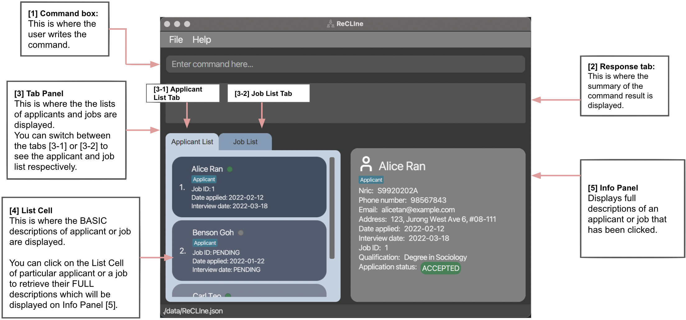
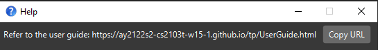

## Introduction

Being a Job Recruiter means working in a **fast paced environment with long hours**, and a need to have **attention to 
details**. It is a job where **time is money** as the number of applicants that sign to a job determines the amount of 
commission earned.

Hence, introducing **ReCLIne**. ReCLIne is a **desktop app which serves as a centralised location for recruiters to 
store and track job applicants and jobs, optimized for use via a Command Line Interface** (CLI) while still having 
the benefits of a Graphical User Interface (GUI). If you can type fast, ReCLIne can get your contact management tasks 
done faster than traditional GUI apps.

## How to use this guide
The **goal of this guide** is to help you, the users, to **understand** how to use our application better. 
* If you are a **new user**, we recommend going to the [Quick Start](#quick-start) section, to learn how to install the 
application onto your device and to have a quick try at some commands that ReCLIne provides.
* If you are an **experienced user**, we recommend going to the [Features](#features) section to view all the commands
available on ReCLIne.

## Table of Contents

* [Introduction](#introduction)
* [How to use this guide](#how-to-use-this-guide)
* [Table of Contents](#table-of-contents)  
* [Quick Start](#quick-start)
* [Features](#features)
  * [Help](#viewing-help--help)
  * [Applicant Commands](#applicant-commands)
    * [Add Applicant](#adding-an-applicant-to-the-applicantlist-addapplicant)
    * [Edit Applicant](#editing-an-applicant-in-the-applicantlist-editapplicant)
    * [Delete Applicant](#delete-an-applicant-deleteapplicant)
    * [Mark Applicant](#mark-an-applicant-markapplicant)
    * [Sort Applicant](#sort-list-of-applicants-sortapplicant)
    * [Find Applicant](#locating-applicants-by-name-findapplicant)
    * [List Applicant](#listing-all-applicants-in-the-applicant-list-listapplicant)
    * [Switch to Applicant Tab](#switch-to-tab-containing-the-applicantlist-tabapplicant)
  * [Job Commands](#job-commands)
    * [Add Job](#adding-a-job-addjob)
    * [Edit Job](#editing-a-job-in-the-joblist-editjob)
    * [Delete Job](#deleting-a-job-deletejob)
    * [Mark Job](#marking-a-job-markjob)
    * [Sort Job](#sorting-jobs-by-job-status-sortjob)
    * [Find Job](#locating-jobs-by-name-findjob)
    * [List Job](#listing-all-jobs-in-the-joblist-listjob)
    * [Switch to Job Tab](#switch-to-tab-containing-the-joblist-tabjob)
  * [Utility Commands](#utility-commands)
    * [Clear](#clearing-all-entries--clear)
    * [Exit](#exiting-the-program--exit)
* [FAQ](#faq)
* [Command Summary](#command-summary)

--------------------------------------------------------------------------------------------------------------------

## Quick Start

1. Ensure you have [Java 11](https://www.oracle.com/java/technologies/downloads/#java11) or above installed in your Computer.

2. Download the latest `ReCLIne.jar` from [here](https://github.com/AY2122S2-CS2103T-W15-1/tp/releases).

3. Copy the file to the folder you want to use as the _home folder_ for your ReCLIne.

4. Double-click the file to start the app. The GUI similar to the below should appear in a few seconds. Note how the app contains some sample data.

<div markdown="span" class="alert alert-info">:information_source: 
If you are a MacOS user and unable to run file by double-clicking, go to Terminal and run `java -jar ReCLIne.jar`.
</div> <br>

   

5. Type the command in the command box [1] and press Enter to execute it. e.g. typing **`help`** and pressing Enter will open the help window.<br>
   Some example commands you can try:

   * **`addapplicant`**` n/Jaden Ho p/92812192 nric/S1234567A a/Tampines St 96 Block 312 e/jadenho@email.com d/2022-03-12` 
     : Adds an applicant named `Jaden Ho` with the inputted NRIC, address, email, phone number, and date applied to the Address Book.

   * **`deleteapplicant`**` 3` : Deletes the 3rd applicant shown in the displayed list.

   * **`editapplicant`**` 1 e/jadenho@email.com q/Degree in Computer Science i/2022-03-18` 
     : Edits the 1st applicant on the displayed list, changing his email, qualification and interview date.

   * **`exit`** : Exits the app.

6. Refer to the [Features](#features) below for details of each command.

--------------------------------------------------------------------------------------------------------------------
## Flags
These flags are used in the commands to indicate which **field you are currently referring to**. 
They are used first before entering adding to corresponding fields.
* For example: `n/Benson Goh` - the `n/` flag is used to indicate that the subsequent input will be the `Applicant Name`.
* For example: `jt/Project Manager` - the `jt/` flag is used to indicate that the subsequent input will be the `Job Title`.

They are commonly used in every command. Details are given below

### Applicant Flags

| Action             | Format, Examples                                                                                                                                                                                                                    |
|--------------------|-------------------------------------------------------------------------------------------------------------------------------------------------------------------------------------------------------------------------------------|
| **`n/`** | Indicate Applicant's **Name**           |
| **`nric/`** | Indicates Applicant's **NRIC** |
| **`p/`** | Indicate Applicant's **Phone Number** |
| **`e/`** | Indicates Applicant's **Email Address**                |
| **`a/`** | Indicates Applicant's **Address**  |
| **`t/`** | Indicates Applicant's **Tags** |
| **`q/`** | Indicates Applicant's **Qualification Requirement** |
| **`d/`** | Indicates Applicant's **Date Applied** |
| **`j/`** | Indicates Applicant's **Job ID** that they applied for          |
| **`i/`** | Indicates Applicant's **Interview Date**           |
| **`s/`** | Indicates Applicant's **Status**                         |
| **`by/`** | Indicates the Applicant field to be **sorted by**  |


### Job Flags

| Action             | Format, Examples                                                                                                                                                                                                                    |
|--------------------|-------------------------------------------------------------------------------------------------------------------------------------------------------------------------------------------------------------------------------------|
| **`jt/`** | Indicates Job's **Job Title** |
| **`c/`** | Indicates Job's **Company** |
| **`a/`** | Indicates Job's **Address**  |
| **`q/`** | Indicates Job's **Qualification Requirement** |
| **`sal/`** | Indicates Job's **Expected Salary** |
| **`js/`** | Indicates Job's **Job Status**  |
| **`pos/`**  | Indicates Job's **Position**       |
| **`id/`**  |  Indicates Job's **Job ID**         |


## Features

<div markdown="block" class="alert alert-info">

**:information_source: Notes about the command format:**<br>

* Words in `UPPER_CASE` are the parameters to be supplied by the user.<br>
  e.g. in `addapplicant n/NAME`, `NAME` is a parameter which can be used as `addapplicant n/John Doe`.

* Items **with** an asterisk before the flag are compulsory.<br>
  e.g `*n/[NAME] *p/[PHONE]` can only be used as `n/John Doe p/93483747`.
  
* Items **without** an asterisk before the flag are optional.<br>
  e.g `*n/[NAME] t/[TAG]` can be used as `n/John Doe t/Applicant` or `n/John Doe`.

* Items with `…​` after them can be used multiple times including zero times.<br>
  e.g. `[t/TAG]…​` can be used as ` ` (i.e. 0 times), `t/friend`, `t/friend t/family` etc.

* Parameters can be in any order.<br>
  e.g. if the command specifies `n/NAME p/PHONE_NUMBER`, `p/PHONE_NUMBER n/NAME` is also acceptable.

* If a parameter is expected only once in the command, but you specified it multiple times, only the last occurrence of
  the parameter will be taken.<br>
  e.g. if you specify `p/12341234 p/56785678`, only `p/56785678` will be taken.

* Extraneous parameters for commands that do not take in parameters 
  (such as `help`, `listapplicant`, `listjob`, `tabapplicant`, `tabjob`, `exit` and `clear`)
  will be ignored.<br>
  e.g. if the command specifies `help 123`, it will be interpreted as `help`.

</div>

### Viewing help : `help` 

Shows a message explaining how to access the help page.



Format: `help`

## Applicant Commands

### Adding an Applicant to the ApplicantList: `addapplicant`

Adds an applicant to the applicant list of ReCLIne.

Format: `addapplicant *n/[NAME] *p/[PHONE] *nric/[NRIC] *a/[ADDRESS] *e/[EMAIL]
            *d/[DATEAPPLIED] t/[TAG]…​`

<div markdown="span" class="alert alert-info">:information_source: 
**Tip:** Fill in fields in any order. **Only fields with `*` indicated are compulsory.**

* **All fields are compulsory for `addapplicant`**, except for `t/[TAG]…​` field.
</div>

*flag/[ATTRIBUTE]:*

`*n/[NAME]`: Applicant's name

`*p/[PHONE]`: Applicant's phone number

`*nric/[NRIC]`: Applicant's NRIC

`*a/[ADDRESS]` : Applicant's address

`*e/[EMAIL]` : Applicant's email address

`*d/[DATEAPPLIED]` : Date that Applicant applied for the job

<div markdown="span" class="alert alert-info">:information_source: 
**Note:** The `[DATEAPPLIED]` field must be in a `YYYY-MM-DD` format. ReCLIne will not accept the date if it is in
any other format.
</div>

`t/[TAG]` : Applicant's Tag

Examples:

`addapplicant n/Jaden Ho p/92812192 nric/S1234567A a/Tampines St 96 Block 312 e/jadenho@email.com d/2022-03-12`

* Adds an applicant with name-Jaden Ho, phone number-92812191, nric-S1234567A, address-Tampines St 96 Block 312
  email-jadenho@email.com, date applied- 2022-03-12 to the applicant list in the ReCLIne.


### Editing an Applicant in the ApplicantList: `editapplicant`

Edits an applicant in the applicant list of ReCLIne.

Format: `editapplicant *[INDEX] n/[NAME] p/[PHONE NUMBER] e/[EMAIL ADDRESS] a/[ADDRESS]
nric/[NRIC] q/[QUALIFICATION] d/[DATE APPLIED] j/[JOB ID]
i/[INTERVIEWDATE] t/[TAG]…​`

<div markdown="span" class="alert alert-info">:information_source: 
**Tip:** Fill in fields in any order. **Only fields with `*` indicated are compulsory.**

* Just input the fields that you would like to change for the specific index number.
* To leave out fields, **skip the flag and attribute** completely.
</div>

*flag/[ATTRIBUTE]:*

`*[INDEX]` : Index number for the applicant on the applicant list. The index should be a positive integer 1, 2, 3...

`n/[NAME]`: Updated Applicant's name

`p/[PHONE]`: Updated Applicant's phone number

`nric/[NRIC]`: Updated Applicant's NRIC

`a/[ADDRESS]` : Updated Applicant's address

`e/[EMAIL]` : Updated Applicant's email address

`nric/[NRIC]` : Updated Applicant's NRIC

`d/[DATEAPPLIED]` : Updated Applicant's application date

<div markdown="span" class="alert alert-info">:information_source: 
**Note:** The `[DATEAPPLIED]` field must be in a `YYYY-MM-DD` format. ReCLIne will not accept the date if it is in
any other format.
</div>

`q/[QUALIFICATION]` : Updated Applicant's qualification

`j/[JOB ID]` : Updated unique ID of the job applicant is applying for

`i/[INTERVIEWDATE]` : Updated Applicant’s upcoming job interview date

<div markdown="span" class="alert alert-info">:information_source: 
**Note:** The `[INTERVIEWDATE]` field must be in a `YYYY-MM-DD` format. ReCLIne will not accept the date if it is in
any other format.
</div>

`t/[TAG]` :  Updated Applicant's Tag

Examples:

`editapplicant 1 n/Bryan Ho a/Tampines St 96 Block 312 e/jadenho@email.com d/2022-03-12 q/Degree in Computer Science
i/2022-03-18`

* Edits an applicant of index 1 with name - Bryan Ho, address - Tampines St 96 Block 312
  email - jadenho@email.com, date applied - 2022-03-12, qualification - Degree of Computer Science,
  interview date - 2022-03-18.
  

### Delete an Applicant: `deleteapplicant`

Deletes an applicant specified by the index from the applicant list in ReCLIne.

Format: `deleteapplicant *[INDEX]`

<div markdown="span" class="alert alert-info">:information_source: 
**Tip:** **Only fields with `*` indicated are compulsory.**
</div>

`*[INDEX]` : Index number for the applicant on the applicant list. The index should be a positive integer 1, 2, 3...

Example:

`deleteapplicant 1`

* Deletes the applicant at index 1 from the applicant list of ReCLIne.


### Mark an Applicant: `markapplicant`

Mark applicant status.

**Fields:** ID, applicant status

Format: `markapplicant *[INDEX] *s/[STATUS]`

<div markdown="span" class="alert alert-info">:information_source: 
**Tip:** Fill in fields in the stipulated order. **Only fields with `*` indicated are compulsory.**

* **All fields are compulsory for `markapplicant`**
</div>

*flag/[Attribute]*

`*[INDEX]` : Index number for the applicant on the applicant list. The index should be a positive integer 1, 2, 3...

`s/[STATUS]`: Flag to mark the applicant status of the applicant. `[STATUS]` must be either
`pending`, `interviewed`, `accepted`, or `rejected`.

**Tip:** All fields are mandatory for the `markapplicant` command. Fill in fields in the stipulated order.

Example:

`markapplicant 104 s/rejected`
- Marks the status of the applicant with index 104 on the list of applicants as rejected.

`markapplicant 105 s/pending`
- Marks the status of the applicant with index 105 on the list of applicants as pending.

`markapplicant 106 s/accepted`
- Marks the status of the applicant with index 106 on the list of applicants as accepted.

`markapplicant 1239 s/interviewed`
- Marks the status of the applicant with index 1239 on the list of applicants as interviewed.


### Sort list of Applicants: `sortapplicant`

Sorts the list of applicants by a given attribute.

**Fields:** attribute to sort the list of applicants by

Format: `sortapplicant *by/[ATTRIBUTE]`

<div markdown="span" class="alert alert-info">:information_source: 
**Tip:** Fill in fields in the stipulated order. **Only fields with `*` indicated are compulsory.**

* All fields for `sortapplicant` are compulsory.
</div>

*flag/[Attribute]*

`*by/[ATTRIBUTE]`: Flag to mark the attribute used to sort the applicant list. [ATTRIBUTE] must be either
`dateapplied`, `interview`, or `job`.

Example:

`sortapplicant by/dateapplied`
- Sorts the list of applicants by the date they applied for the job listing, in order of earliest to latest.

`sortapplicant by/interview`
- Sorts the list of applicants by their scheduled interview date, in order of earliest to latest.
- Applicants who have yet to schedule an interview will be ranked lower.

`sortapplicant by/job`
- Sorts the list of applicants by the job they have applied, in order of smallest to largest job ID.
- Applicants who have yet to apply for a specific job listing will be ranked lower.


### Locating applicants by name: `findapplicant`

Finds applicants in the applicant list by their name.

Format: `findapplicant KEYWORD…​`

*flag/[Attribute]*

`KEYWORD…​`: Search for an applicant name containing the `KEYWORD…​`.
* The search is case-insensitive. e.g `alice` will match `Alice`
* The order of the keywords does not matter. e.g. `Alice Goh` will match `Goh Alice`
* Only full words will be matched e.g. `Ali` will not match `Alice`
* Applicants matching at least one keyword will be returned (i.e. `OR` search).
  e.g. `Alice` will return `Alice Tan Mei Ling`, `Alice Goh Ming Yue`

Examples:
* `findapplicant Alice` returns anyone in the applicant list that has "Alice" in their name.
  <br>
  

### Listing all applicants in the Applicant List: `listapplicant`

Lists out all the applicants that are in the ApplicantList.
This will help to display all the applicants in the applicant list again, after finding a particular applicant by `findapplicant`.

Format: `listapplicant` <br>


### Switch to tab containing the ApplicantList: `tabapplicant`

Switches to the `applicant list` tab in the GUI (the changes are reflected on the application window)

Format: `tabapplicant` <br>

## Job Commands

### Adding a Job: `addjob`
Adds a new job posting to ReCLIne

Format: `addjob *jt/[JOB TITLE] *c/[COMPANY] *a/[ADDRESS] *q/[QUALIFICATION] *pos/[POSITION] *sal/[SALARY]`

<div markdown="span" class="alert alert-info">:information_source: 
**Tip:** Fill in fields in any order. **Only fields with `*` indicated are compulsory.**

* **All fields are compulsory for `addjob``**.
</div>

*flag/[Attribute]:*

`*jt/[JOB TITLE]`: Job title of the job

`*c/[COMPANY]`: The company for the job opening 

`*a/[ADDRESS]`: Location of the job 

`*q/[QUALIFICATION]`: Education qualification required for the job

`*pos/[POSITION]`: Type of job, whether part-time or full time.

<div markdown="span" class="alert alert-info">:information_source: 
**Note:** The `[POSITION]` field only accepts either `ft` - "full time" or `pt` - "part time" as an input. ReCLIne will output an error is anything
else is inputted.
</div>

`*s/[SALARY]`:  Salary of job, based on how much the job pays a month. The start and end of the SALARY range must be a positive integer
1000,2000,3000,...

<div markdown="span" class="alert alert-info">:information_source: 
**Note:** The inputted `[SALARY]` must be a range. The lower bound of the range cannot be larger than the upper bound 
of the range. For example "4000 - 3000" is an invalid salary range, and ReCLIne will output an error. 
A range where the lower bound is equal to the upper bound is accepted.
</div>

Example:

`addjob jt/Software Developer c/Ebiz Pte Ltd a/59 Hougang Road Blk 38 q/Bachelors in Computer Science pos/ft sal/3000-4000 `

* Adds a job called Software Developer, for a company Ebiz Pte Ltd. The location of the job is at Hougang Road Blk 38,
and it requires a Bachelors in Computer Science. This is a full time position with a salary between 3000-4000.
  

### Editing a Job in the JobList: `editjob`

Edits a job in the job list of the ReCLIne.
This will allow you to be able to keep all the information about a job updated, negating the possibility of sending
outdated information to applicants.

Format: `editjob *[INDEX] jt/[JOB TITLE] c/[COMPANY NAME] a/[ADDRESS]
q/[QUALIFICATION] pos/[POSITION] sal/[SALARY]`

<div markdown="span" class="alert alert-info">:information_source: 
**Tip:** Fill in fields in any order. **Only fields with `*` indicated are compulsory.**

* Just input the fields that you would like to change for the specific index number.
* To leave out fields, **skip the flag and attribute** completely.
</div>

*flag/[ATTRIBUTE]:*

`*[INDEX]` : The index displayed in the job list of ReCLIne. Index should be a positive integer.

`jt/[JOB TITLE]`: Update Job's Title to the mentioned `[JOB TITLE]`

`c/COMPANY NAME]`: Update the Job's Company Name to the inputted`[COMPANY NAME]`

`q/[QUALIFICATION]` : Update the Job's qualification requirement to `[QUALIFICATION]`

`a/[ADDRESS]` : Update the Job's workplace address to `[ADDRESS]`

`pos/[POSITION]` : Update Job's position to `[POSITION]`

<div markdown="span" class="alert alert-info">:information_source: 
**Note:** The `[POSITION]` field only accepts either `ft` - "full time" or `pt` - "part time" as an input. ReCLIne will output an error is anything
else is inputted.

</div>

`sal/[SALARY]` : Update the Job to edit the salary to `[SALARY]`

<div markdown="span" class="alert alert-info">:information_source: 
**Note:** The inputted `[SALARY]` must be a range. The lower bound of the range cannot be larger than the upper bound 
of the range. For example "4000 - 3000" is an invalid salary range, and ReCLIne will output an error.
A range where the lower bound is equal to the upper bound is accepted. For example "4000 - 4000" is allowed. This 
indicates that the salary is not a range, but rather a fixed amount.

</div>

Examples:

`editjob 1 jt/Software Engineer UI c/Desginer Club q/Degree in Computer Science a/123 Block 3 Designer Road pos/ft 
sal/4000 - 5000`

* Edits a job with index number 1 with job title - Software Engineer UI comapny name - Designer Club,
  qualification - Degree of Computer Science, address - Block 3 Designer Road, 
  position - full time, salary range - 4000 - 5000. <br>
  

### Deleting a job: `deletejob`

Delete a job specified by the index from the job list of ReCLIne.

Format: `deletejob *[INDEX]`

<div markdown="span" class="alert alert-info">:information_source: 
**Tip:** **Only fields with `*` indicated are compulsory.**
</div>

`*[INDEX]` : The index displayed in the job list of ReCLIne. Index should be a positive integer.

Example:

`deletejob 1`

*Deletes the job at index 1 from the job list of ReCLIne.


### Marking a Job: `markjob`
Marks an existing job posting as filled or vacant.

Format: `markjob *[INDEX] *js/[JOBSTATUS]`

<div markdown="span" class="alert alert-info">:information_source: 
**Tip:** Fill in fields in the stipulated order. **Only fields with `*` indicated are compulsory.**

* **All fields are compulsory for `markjob`**
</div>

*flag/[Attribute]:*

`*[INDEX]` : The index displayed in the job list of ReCLIne. Index should be a positive integer.

`*js/[JOB STATUS]`: The new status of the job posting.

<div markdown="span" class="alert alert-info">:information_source: 
**Note:** The `[JOB STATUS]` field only accepts either `filled` or `vacant` as an input. ReCLIne will 
output an error if anything else is inputted.
</div>

Example:

`markjob 23 js/filled`
* Marks the job listing at index 23 as filled.

`markjob 41 js/vacant`
* Marks the job listing at index 41 as vacant.


### Sorting jobs by Job Status: `sortjob`

Sort the jobs in the job list of ReCLIne by the job status. Job status can be either 'filled' or 'vacant'.

Format: `sortjob`


### Locating jobs: `findjob`

Find jobs in the job list either by `Job Title` or by `Job ID`. Find jobs by Job Title by matching job titles in 
`Job List` to the inputted keywords. Find jobs by `Job ID` by matching the job id in `Job List` to the inputted integer id.

Format (search via job title): `findjob jt/KEYWORD [MORE_KEYWORDS]`
Format (search via job ID): `findjob id/[ID]`

***flag/[Attribute]***

`jt/[KEYWORD] KEYWORD`: Search for job title containing the `[KEYWORD]`. 
* The search is case-insensitive. e.g `engineer` will match `Engineer`
* The order of the keywords does not matter. e.g. `Software Engineer` will match `Engineer Software`
* Only full words will be matched e.g. `Software` will not match `Soft`
* Jobs matching at least one keyword will be returned (i.e. `OR` search).
  e.g. `Engineer` will return `Software Engineer`, `Chemical Engineer`

`id/[ID]` : Search for job with matching `[ID]`.

Examples:
* `findjob jt/Engineer` returns `software engineer` and `Mech Engineer`
* `findjob id/2` returns a job with id 2 <br>


### Listing all jobs in the JobList: `listjob`

Lists out all the jobs that are in the JobList.
This will help to display all the jobs in the JobList again, after finding a particular job by `findjob`.

Format: `listjob` <br>


### Switch to tab containing the JobList: `tabjob`

Switches to the `job list` tab in the GUI (the changes are reflected on the application window

Format: `tabjob` <br>

## Utility Commands

### Clearing all entries : `clear`

Clears all entries from the address book.

Format: `clear`

### Exiting the program : `exit`

Exits the program.

Format: `exit`

### Saving the data

ReCLIne data are saved in the hard disk automatically after any command that changes the data. There is no need to save manually.

### Editing the data file

Users who are unfamiliar with programming can safely ignore this section of the user guide.
ReCLIne data are saved as a JSON file `[JAR file location]/data/ReCLIne.json`. We strongly advise users __not__ to edit the data file as a single wrong error such as naming the "applicants" array as "Applicants" will cause the data file to fail and start with an empty list.
Advanced users who are familiar with Javascript and JSON objects are welcome to update data directly by editing that data file, and following the sample format shown below.

<div markdown="span" class="alert alert-warning">:exclamation: **Caution:**
We would like to remind users again, if your changes to the data file makes its format invalid, ReCLIne will discard all data and start with an empty data file at the next run.
</div>

```
{
 "applicants" : [ {
    "name" : "Alice Tan",
    "phone" : "98567843",
    "email" : "alicetan@example.com",
    "address" : "123, Jurong West Ave 6, #08-111",
    "tagged" : [ "Applicant" ],
    "nric" : "S9920202A",
    "job" : "2",
    "qualification" : "Degree in Sociology",
    "dateApplied" : "2022-02-12",
    "interviewDate" : "2022-03-18",
    "applicationStatus" : "1"
  }] ,
  "jobs" : [ {
    "jobTitle" : "Data Analyst",
    "companyName" : "Facebook",
    "id" : "1",
    "address" : "9 Straits View, Marina One",
    "qualification" : "Degree in Data Science",
    "jobStatus" : "filled",
    "position" : "ft",
    "salary" : "6000-8000"
  }] ,
  "idCount" : 11
}
```


--------------------------------------------------------------------------------------------------------------------

## FAQ

**Q**: How do I transfer my data to another Computer?<br>

**A**: <ol><li>Download the `ReCLIne.jar` to a new empty folder on your other Computer.</li>
          <li>Run the application for the first time on your new device by double clicking on the `ReCLIne.jar` file.</li>
          <li>Run the command `deletejob 1` to save a new data file.</li>
          <li>In the folder containing your `ReCLIne.jar` go into the `data` folder.</li>
          <li>Delete the `ReCLIne.json` file here, then copy the `ReCLIne.json` file on your old device to this folder. The file can be found in the same folder on your old device as your new device.</li> 
       </ol>
        The file structure of your new ReCLIne application should be as such after Step 2.
```
folderContainingReCLIne
| addressbook.log.0
| config.json
| preferences.json
| ReCLIne.jar
|
└─── data
     | ReCLIne.json
```
       

--------------------------------------------------------------------------------------------------------------------

## Command summary

| Action             | Format, Examples                                                                                                                                                                                                                    |
|--------------------|-------------------------------------------------------------------------------------------------------------------------------------------------------------------------------------------------------------------------------------|
| **Add Applicant**  | `addapplicant *n/[NAME] *p/[PHONE] *nric/[NRIC] *a/[ADDRESS] *e/[EMAIL] *d/[DATEAPPLIED]​` <br> e.g.,`addapplicant n/James Ho p/22224444 nric/S9913138H a/123, Clementi Rd, 1234665 e/jamesho@example.com d/2022-01-02`             |
| **Edit Applicant** | `editapplicant *[INDEX] n/[NAME] p/[PHONE NUMBER] e/[EMAIL ADDRESS] nric/[NRIC] q/[QUALIFICATION] d/[DATE APPLIED] j/[JOB ID] i/[INTERVIEWDATE] s/[STATUS] t/[TAG]​` <br> e.g.,`editapplicant 2 n/James Lee e/jameslee@example.com` |
| **Delete Applicant** | `deleteapplicant *[INDEX]`<br> e.g., `deleteapplicant 3`                                     |
| **Mark Applicant** | `markapplicant *[INDEX] *s/[STATUS] ​` <br> e.g.,`markapplicant 2 s/rejected`       |
| **Sort Applicant** | `sortapplicant *by/[ATTRIBUTE]` <br> e.g., `sortapplicant by/dateapplied` |
| **Find Applicant** | `findapplicant KEYWORD…​` <br> e.g., `findapplicant Alice` |
| **List Applicant** | `listapplicant` |
| **Switch to Applicant Tab** | `tabapplicant` |
| **Add Job**  | `addjob *jt/[JOB TITLE] *c/[COMPANY] *a/[ADDRESS] *q/[QUALIFICATION] *pos/[POSITION] *sal/[SALARY]` <br> e.g., `addjob jt/Software Developer c/Ebiz Pte Ltd a/59 Hougang Road Blk 38 q/Bachelors in Computer Science pos/ft sal/3000 - 4000 `             |
| **Edit Job** | `editjob *[INDEX] jt/[JOB TITLE] c/[COMPANY NAME] a/[ADDRESS]q/[QUALIFICATION] pos/[POSITION] sal/[SALARY]` <br> e.g.,  `editjob 1 jt/Software Engineer UI/UX c/Desginer Club q/Degree in Computer Science a/123 Block 3 Designer Road pos/ft sal/4000 - 5000` |
| **Delete Job** | `deletejob *[INDEX]`<br> e.g., `deletejob 3`                                     |
| **Mark Job** | `markjob *[INDEX] *js/[STATUS] ​` <br> e.g.,`markjob 2 js/vacant`       |
| **Sort Job** | `sortjob`  |
| **Find Job** | `findjob jt/KEYWORD [MORE_KEYWORDS]` <br> e.g., `findjob jt/Engineer` <br>***OR***<br> `findjob id/[ID]` <br> e.g., `findjob id/2` |
| **List Job** | `listjob` |
| **Switch to Job Tab** | `tabjob` |
| **Help**           | `help`              |
| **Clear**           | `clear`              |
| **Exit**           | `exit`              |
